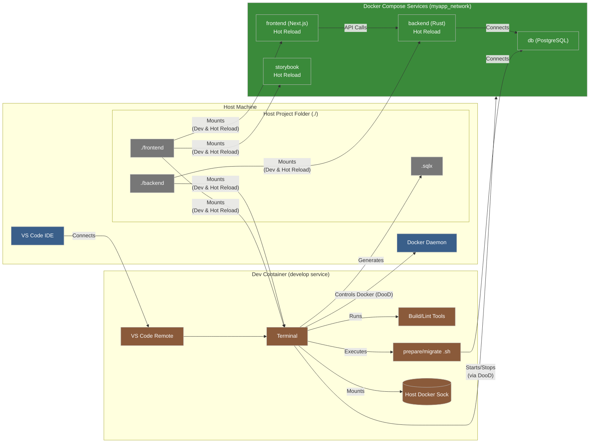

# DDD プロダクト開発 サンプル (Rust バックエンド & Next.js フロントエンド, 日本語 UL)

これは、ドメイン駆動設計 (DDD) の原則と軽量なプロダクト開発プロセスを組み合わせたサンプルアプリケーションです。
**具体的には、「記念日プレゼント予約・配送サービス」を題材としています。**
バックエンド (`backend/`) は Rust で実装され、**フロントエンド (`frontend/`) は Next.js (React + TypeScript) で実装されています。**
開発環境は Docker Compose で構築されています。

**バックエンドの特徴:**

- **Web フレームワーク**: `axum` を使用。
- **非同期ランタイム**: `tokio` を使用。
- **データベースアクセス**: `sqlx` を使用 (PostgreSQL)。
- **API ドキュメント**: `utoipa` を使用して OpenAPI 仕様を生成し、Swagger UI で表示。
- **関数型スタイル**: ドメインロジックは副作用を極力排した関数として実装。
- **Railway Oriented Programming (ROP)**: `Result` 型を活用。
- **オニオンアーキテクチャ**: Domain, Application, Infrastructure の層分離。
- **日本語ユビキタス言語**: ドメイン層の命名に日本語を採用。
- **依存性の注入 (DI)**: `main` 関数でリポジトリ等を注入。

## 主な概念

- **ドメイン (Domain)**: ビジネスルールとロジックの中核。値オブジェクト (`商品ID`, `注文ID`)、エンティティ (`注文`, `商品`)、ドメインエラー (`DomainError`)、ドメインロジック関数、リポジトリインターフェース（トレイト）が含まれます。
- **アプリケーション (Application)**: ユースケース（ワークフロー）を実装。ドメイン層のオブジェクトや関数をオーケストレーションし、リポジトリを通じて永続化などを扱います。アプリケーション固有のエラー (`ApplicationError`) も定義します。
- **インフラストラクチャ (Infrastructure)**: データベースアクセス、外部 API 連携など、技術的な詳細を実装。ここではインメモリのダミーリポジトリ (`InMemory注文Repository`, `InMemory商品Repository`) を提供します。

## アーキテクチャ

このサンプルではオニオンアーキテクチャを採用しています。
詳細については、以下のドキュメントを参照してください。

- **アーキテクチャ概要**: [`docs/architecture/overview.md`](docs/architecture/overview.md)
- **ドメインモデル**: [`docs/domain/domain-model.md`](docs/domain/domain-model.md) (Mermaid 形式)
- **ユビキタス言語**: [`docs/domain/ubiquitous-language.md`](docs/domain/ubiquitous-language.md)

### 主要ドキュメント

- [プロダクト開発ガイドライン (Product Development Guide)](docs/PRODUCT_DEVELOPMENT_GUIDE.md) ✨ **まずはこちらをお読みください**
- [プロダクト定義 (Product Definition)](docs/product/) - 主要ファイル: [ビジョン＆戦略](docs/product/vision_strategy.md), [ロードマップ](docs/product/roadmap.md)
- [要求/仕様 (Requirements)](docs/requirements/) - 具体例: [ユーザーストーリーマップ](docs/requirements/user_story_mapping.md)
- [ドメイン関連 (Domain)](docs/domain/) - 主要ファイル: [ユビキタス言語](docs/domain/ubiquitous-language.md), [モデル図](docs/domain/domain-model.md)
- [アーキテクチャ関連 (Architecture)](docs/architecture/) - 主要ファイル: [概要](docs/architecture/overview.md), [ADR](docs/architecture/adr/)
- [開発プロセス (Process)](docs/process/) - 主要ファイル: [イテレーション計画](docs/process/iteration_planning.md)

## 開発環境 (Docker + Dev Containers) ✨

このプロジェクトは、Docker Compose と VS Code Dev Containers を利用して、統一された開発環境を提供します。

### システム構成図



### 前提条件

- Docker および Docker Compose
- Visual Studio Code (または Cursor のような VS Code ベースのエディタ)
- VS Code 拡張機能: [Dev Containers](https://marketplace.visualstudio.com/items?itemName=ms-vscode-remote.remote-containers)

### 初回セットアップ

1.  **リポジトリのクローン:**
    ```bash
    git clone https://github.com/nihemak/ddd-product-dev-sample-jp
    cd ddd-product-dev-sample-jp
    ```
2.  **VS Code で開く:**
    VS Code でプロジェクトフォルダ (`ddd-product-dev-sample-jp`) を開きます。
3.  **Dev Container で開く:**
    VS Code 右下の通知、またはコマンドパレット (Cmd/Ctrl+Shift+P) で `Dev Containers: Reopen in Container` を選択し、Dev Container 環境をビルド・起動します。
    (初回ビルドには時間がかかる場合があります)

### 日常的な開発フロー

1.  **Dev Container の起動:** VS Code でプロジェクトを開くと、自動的に Dev Container が起動します。
2.  **開発用サービスの起動:** Dev Container 内の VS Code ターミナルで、必要なサービスを起動します。
    ```bash
    # データベース、バックエンド、フロントエンド、Storybook を起動
    docker compose up -d db backend frontend storybook
    ```
3.  **データベースマイグレーション (初回またはスキーマ変更時):**
    `db` サービスが起動している状態で、以下のスクリプトを実行してデータベースのテーブルを作成・更新します。
    ```bash
    # 実行権限を付与 (初回のみ)
    chmod +x migrate-db.sh
    # マイグレーション実行
    ./migrate-db.sh
    ```
4.  **SQLx オフラインデータの準備 (SQL クエリ変更時):**
    バックエンドの Rust コード内で `sqlx::query!` マクロを使用する SQL を変更した場合、`rust-analyzer` のチェック用にオフラインデータを更新する必要があります。
    `db` サービスが起動している状態で、以下のスクリプトを実行します。
    ```bash
    # 実行権限を付与 (初回のみ)
    chmod +x prepare-sqlx.sh
    # SQLx データ準備実行
    ./prepare-sqlx.sh
    ```
    これにより `backend/.sqlx` ディレクトリ内のデータが更新されます。変更は Git にコミットしてください。
5.  **アプリケーションへのアクセス:**
    - フロントエンド: `http://localhost:3000`
    - バックエンド API ドキュメント (Swagger UI): `http://localhost:8080/swagger-ui/`
    - Storybook: `http://localhost:6006`
6.  **ホットリロード:**
    - **バックエンド:** `/workspace/backend/src` 以下の Rust コードを変更すると、`backend` コンテナ内で自動で再コンパイル・再起動されます (反映にはコンパイル時間分のラグがあります)。Swagger UI などは手動でリロードが必要です。
    - **フロントエンド:** `/workspace/frontend/src` 以下のコードを変更すると、ブラウザ上で自動で変更が反映されます (HMR)。
    - **Storybook:** `/workspace/frontend/src` 以下のコンポーネントやストーリーを変更すると、ブラウザ (`localhost:6006`) 上で自動で変更が反映されます (HMR)。
7.  **ログの確認:**
    ```bash
    docker compose logs -f backend
    docker compose logs -f frontend
    # 他のサービスも同様
    ```
8.  **サービスの停止:**
    ```bash
    docker compose down
    # または docker compose stop <サービス名>
    ```

### トラブルシューティング

- **共有ボリュームの権限エラー:** Dev Container 内で `cargo check`/`build` や `npm install` などを実行した際に、`/workspace/backend/target` や `/workspace/frontend/node_modules` といった共有ボリュームへの書き込み権限エラーが発生することがあります。その場合、一時的な対処として Dev Container のターミナルで `sudo chown -R vscode:vscode /path/to/volume` (例: `/workspace/backend/target`) を実行する必要があるかもしれません。根本的な原因と恒久対策については、[`docs/technical_tasks.md`](docs/technical_tasks.md) の関連タスクを参照してください。
- **`cargo clean` の失敗:** Dev Container 内で `cargo clean` を実行すると "Device or resource busy" エラーで失敗することがあります。これは共有ボリュームのマウントポイントが原因と考えられますが、`cargo build`/`check` などは問題なく動作するため、現状は許容しています。詳細は [`docs/technical_tasks.md`](docs/technical_tasks.md) の関連タスクを参照してください。

### 環境変数 (.env ファイル)

現在、ローカル開発環境では `.env` ファイルは必須ではありません。データベース接続情報などは `docker-compose.yml` や `prepare-sqlx.sh`, `migrate-db.sh` スクリプト内で管理されています。

## テスト

### 単体・結合テスト (バックエンド)

`cargo test` を使用して、ユニットテスト（主にドメイン層）と結合テスト（アプリケーション層・インフラ層）を実行します。

```bash
# プロジェクトルートから実行
docker compose exec backend cargo test
# または、バックエンドディレクトリ内で直接実行
# cd backend
# cargo test
```

- **Domain 層**: ドメインロジックの純粋性を検証。
- **Application 層**: `mockall` を使用して依存性をモック化し、ユースケースを検証。
- **Infrastructure 層**: 実際の DB コンテナに接続してリポジトリ実装を検証するテストも含まれる場合があります。

### API エンドポイントテスト

`backend/tests/` ディレクトリ (今後作成予定) にて、`reqwest` クレートなどを用いて実際の API エンドポイントを叩くテストを実装します。これらのテストも `cargo test` で実行されます。

## 構成

```
.
├── .env.sample         # 環境変数サンプル
├── .gitignore          # Gitで無視するファイル
├── docker-compose.yml  # Docker Compose 設定
├── backend/            # バックエンド Rust プロジェクト
│   ├── Cargo.toml      # プロジェクト定義と依存関係
│   ├── Cargo.lock      # 依存関係のロックファイル
│   ├── Dockerfile      # バックエンド用 Dockerfile
│   └── src/
│       ├── lib.rs      # ライブラリクレートのエントリ、モジュール宣言
│       ├── main.rs     # アプリケーションのエントリ、DIコンテナ、サーバー起動、OpenAPI定義
│       ├── domain.rs   # Domain層
│       ├── application.rs # Application層
│       ├── infrastructure.rs # Infrastructure層
│       └── routes/     # (Axum 用に再構成予定) APIルートハンドラ
├── frontend/           # フロントエンド Next.js プロジェクト
│   ├── Dockerfile      # フロントエンド用 Dockerfile
│   ├── package.json    # 依存関係、スクリプト等
│   └── src/            # ソースコード (App Router ベース)
├── docs/               # ドキュメントルート
│   ├── product/        # プロダクト定義
│   ├── requirements/   # 要求/仕様
│   ├── domain/         # ドメイン関連
│   ├── architecture/   # アーキテクチャ関連 (ADR含む)
│   └── process/        # 開発プロセス関連
└── target/             # (Git無視) ビルド成果物
```

## 目的

このサンプルプロジェクトは、以下の複数の目的を持っています。

1.  **Rust による実践的な DDD の実装例:**

    - Rust を用いてドメイン駆動設計 (DDD) の原則（特に日本語ユビキタス言語、オニオンアーキテクチャ）を適用する具体的な方法を示すこと。
    - 関数型プログラミングのスタイル（純粋関数中心のロジック、Railway Oriented Programming によるエラー処理）を Rust で実践する例を示すこと。

2.  **軽量なプロダクト開発プロセスの提示:**
    - プロダクトの「Why」（ビジョン、戦略）から「What」（要求定義）、そして「How」（設計、実装）までを、ドキュメント（Markdown, Mermaid 等）を活用して一貫して繋げる、軽量な開発プロセスの一例を示すこと。
    - DDD のプラクティス（ユビキタス言語、ドメインモデリング）を、技術実装だけでなく要求定義やプロダクト定義の段階から活用するアプローチを示すこと。

これらの目的を通じて、Rust でのアプリケーション開発や DDD の実践、あるいは軽量なプロダクト開発プロセスの導入を検討する際の、具体的な出発点や学習リソースとなることを目指しています。
