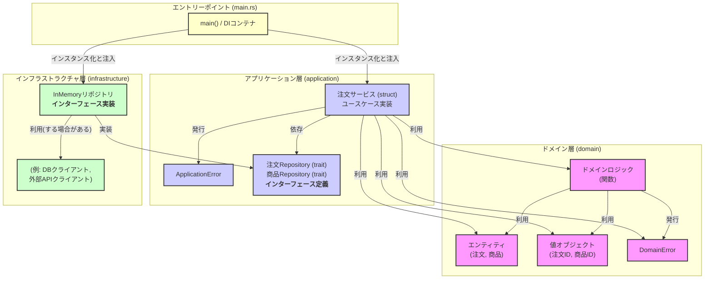

# Rust 関数型DDDサンプル (日本語ユビキタス言語)

これは、Rustを用いてドメイン駆動設計 (DDD) の原則に基づいた簡単なサンプルアプリケーションです。
以下の特徴を持っています：

*   **関数型スタイル**: ドメインロジックは副作用を極力排した関数として実装されています。
*   **Railway Oriented Programming (ROP)**: `Result` 型と `and_then`, `map_err` などを活用し、エラー処理を含むワークフローを直線的に記述しています。
*   **オニオンアーキテクチャ**: 関心事を Domain, Application, Infrastructure の層に分離しています。
    *   `src/main.rs` 内に `mod domain`, `mod application`, `mod infrastructure` として定義されています。
*   **日本語ユビキタス言語**: ドメイン層の型名や関数名には、日本語（またはそのローマ字表記）を積極的に採用しています（例: `注文`, `商品ID`, `mark_as_preparing`）。
*   **依存性の注入 (DI)**: Application層はRepositoryのインターフェース（トレイト）に依存し、具体的な実装は `main` 関数で注入されます（ここではインメモリ実装を使用）。

## 主な概念

*   **ドメイン (Domain)**: ビジネスルールとロジックの中核。値オブジェクト (`商品ID`, `注文ID`)、エンティティ (`注文`, `商品`)、ドメインエラー (`DomainError`)、ドメインロジック関数、リポジトリインターフェース（トレイト）が含まれます。
*   **アプリケーション (Application)**: ユースケース（ワークフロー）を実装。ドメイン層のオブジェクトや関数をオーケストレーションし、リポジトリを通じて永続化などを扱います。アプリケーション固有のエラー (`ApplicationError`) も定義します。
*   **インフラストラクチャ (Infrastructure)**: データベースアクセス、外部API連携など、技術的な詳細を実装。ここではインメモリのダミーリポジトリ (`InMemory注文Repository`, `InMemory商品Repository`) を提供します。

## アーキテクチャ詳細

このサンプルではオニオンアーキテクチャを採用しています。これは、関心の分離と依存関係の方向性を管理するためのアーキテクチャパターンです。

**依存関係の原則**: 依存関係は常に外側から内側へ向かいます。つまり、

*   **Infrastructure** 層は **Application** 層と **Domain** 層に依存できます（ただし、このサンプルでは Application 層で定義されたトレイトを実装することで依存性を逆転させています）。
*   **Application** 層は **Domain** 層にのみ依存します。
*   **Domain** 層は他のどの層にも依存しません。

これにより、ビジネスロジックの中核であるドメイン層が、UI、データベース、外部サービスなどの具体的な技術詳細から隔離され、変更に強く、テストしやすい構造を実現します。

**依存性の逆転**: Application 層は具体的な Repository の実装を知りません。代わりに、Domain 層で定義された `注文Repository` や `商品Repository` といったインターフェース（トレイト）に依存します。Infrastructure 層がこれらのトレイトを実装し、アプリケーションの起動時（`main` 関数）にその具体的な実装（ここでは `InMemory~Repository`）が Application 層のサービス（`注文サービス`）に注入されます。これにより、Domain 層と Application 層は Infrastructure 層の詳細から切り離されます。

以下に、このプロジェクトのアーキテクチャと依存関係を図示します。



## 実行方法

1.  Rustのツールチェインがインストールされていることを確認してください。
2.  プロジェクトのルートディレクトリで以下のコマンドを実行します。

    ```bash
    cargo run
    ```

これにより、依存関係がダウンロード・コンパイルされ、`src/main.rs` 内のサンプルコードが実行されます。
コンソールに注文の作成、状態遷移、エラーハンドリングの過程が出力されます。

## テスト

このプロジェクトにはユニットテストが含まれています。各モジュールファイル (`src/domain.rs`, `src/application.rs`) 内にテストコード (`#[cfg(test)] mod tests { ... }`) が記述されています。

テストの実行は以下のコマンドで行います。

```bash
cargo test
```

*   **Domain層のテスト**: ドメインロジック関数の純粋性を検証します。
*   **Application層のテスト**: `mockall` クレートを使用してリポジトリインターフェース（トレイト）をモック化し、ユースケース（`注文サービス`）が期待通りにドメインロジックやリポジトリメソッドを呼び出すかを検証します。

## 構成

```
.
├── Cargo.toml          # プロジェクト定義と依存関係
├── Cargo.lock          # 依存関係のロックファイル
├── .gitignore          # Gitで無視するファイル
├── src/
│   ├── main.rs         # アプリケーションのエントリーポイント (バイナリクレート)
│   ├── lib.rs          # ライブラリクレートのエントリーポイント、モジュール宣言
│   ├── domain.rs       # Domain層のコードとテスト
│   ├── application.rs  # Application層のコードとテスト
│   └── infrastructure.rs # Infrastructure層のコード
└── target/             # (Git無視) ビルド成果物
```

## 目的

このサンプルは、Rustにおける関数型DDD、ROP、オニオンアーキテクチャの基本的な実装方法を示すことを目的としています。
実際のアプリケーション開発の出発点として、またはこれらの概念を学習するための参考として利用できます。 