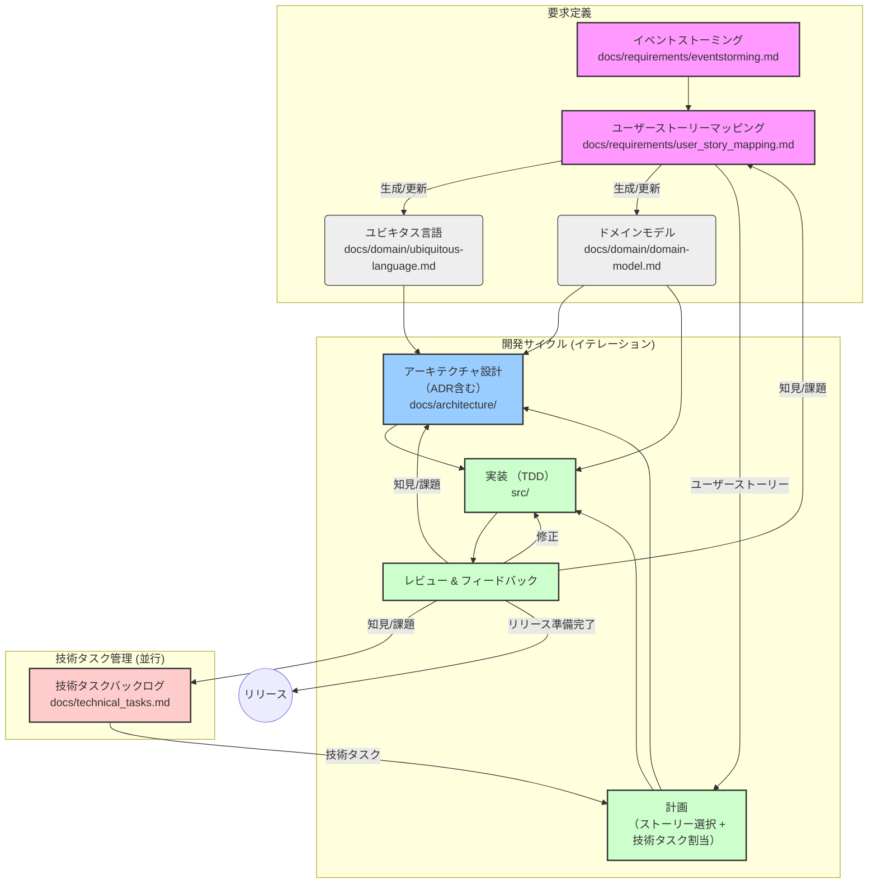

# 開発ガイドライン

このドキュメントは、本プロジェクトにおける開発プロセス、ドキュメントの役割、およびシームレスな連携を維持するためのガイドラインを定めます。

## 開発の全体像

本プロジェクトでは、ドメイン駆動設計 (DDD) の考え方に基づき、要求定義から実装までを以下の流れで進めることを推奨します。

この図は開発プロセス全体の流れを示しています。以下に、主要なフェーズとアクティビティについて詳述します。

## 要求定義

ソフトウェアが解決すべき課題とビジネス要求を深く理解し、開発のスコープと共通言語を定義するフェーズです。

### 1. 要求・仕様の探求 (イベントストーミングの活用)

*   **目的**: ビジネス要求を深く理解し、ドメインイベント、コマンド、アクター、重要な概念（集約など）を洗い出す。
*   **手法**: ドメインエキスパートや関係者と共に**イベントストーミング**を実施します。
    *   (a) ドメインイベント（起こった事実、過去形）をオレンジ色の付箋に書き出し、時間軸に沿って並べます (例: `注文が受け付けられた`, `支払いが行われた`, `商品が発送された`)。
    *   (b) 各イベントのトリガーとなったコマンド（操作、命令形）を青色の付箋に書き、イベントの前に置きます (例: `注文を受け付ける`, `支払いを実行する`, `商品を発送する`)。
    *   (c) コマンドを実行したアクター（人、システム）を黄色の付箋に書き、コマンドの近くに置きます (例: `顧客`, `支払いシステム`, `倉庫担当者`)。
    *   (d) コマンドやイベントに関連するビジネスの中心的なモノ（集約）をピンク色の付箋に書き出します (例: `注文`, `支払い`, `在庫`)。
    *   (e) その他、参照情報（Read Model 例: `商品価格`）、外部システム（例: `配送サービス`）、ルール（Policy 例: `割引適用ルール`）、課題なども必要に応じて書き出します。
*   **成果物**: イベントストーミングの結果（図、リスト、ワークフロー、課題など）を `docs/requirements/eventstorming.md` に記録します。ここで発見された用語はユビキタス言語の重要な候補となります。

### 2. ドメインモデリングとユーザーストーリーへの落とし込み (ユーザーストーリーマッピングの活用)

*   **目的**: イベントストーミングで得られた知見を基に、**ユーザー視点**で機能を整理・視覚化し、開発の優先順位を決定する。ドメインモデル設計とユビキタス言語定義のインプットとする。
*   **手法**: **ユーザーストーリーマッピング**を実施します。
    *   **(a) バックボーンの定義 (横軸)**: ユーザーが目的を達成するための一連の**主要な活動やタスク**を洗い出します (例: `商品検索`, `カート追加`, `注文確定`, `支払い`, `注文確認`)。イベントストーミングのアクターの行動や主要コマンド群がヒントになります。これらを時間的・論理的な順序で横に並べます。
    *   **(b) ユーザーストーリーの洗い出し (縦軸)**: バックボーンの各タスクを実現するために必要な**具体的な機能**をユーザーストーリーとして記述します (例: `キーワードで商品を検索できる`, `商品をカートに入れる`, `注文内容を確認する`)。「<ユーザー種別>として、<達成したいこと>をしたい、なぜなら<理由>」形式が理想ですが、簡潔なタスク記述でも構いません。イベントストーミングのコマンドやRead Model要求がストーリーの候補になります。**エラーケースや代替フロー**も忘れずに洗い出します。
    *   **(c) マッピング**: 各ユーザーストーリーを、関連するバックボーンのタスクの下に縦に並べていきます。
    *   **(d) 優先順位付けとリリース計画**: マップ上のストーリーを、開発の優先順位（価値の高さ、緊急度、依存関係など）に基づき、**縦方向に並べ替えます**（上が優先度高）。次に、**横方向に区切り線**などを入れ、MVP（Minimum Viable Product）やリリースバージョンごとにストーリーをグルーピングします。これにより、段階的な開発計画が視覚化されます。
*   **成果物**:
    *   ユーザーストーリーマップの結果（バックボーン、ストーリー、リリース計画）を `docs/requirements/user_story_mapping.md` に記録します。
        *   **記録形式:** チームの合意に基づき、以下のいずれか、または組み合わせを選択します。
            *   **Draw.io (diagrams.net) 図の埋め込み (`.drawio.svg`)**: 視覚的なマップが主情報源となる場合（推奨）。図を `user_story_mapping.drawio.svg` として保存し、`user_story_mapping.md` に埋め込みます。必要に応じてテキスト補足を追加します。
            *   **リスト形式**: テキストベースでの編集・管理を重視する場合。バックボーンを `###`、リリースを `##`、ストーリーを `- [ ]` で表現。
            *   **テーブル形式**: 構造的な一覧性を重視する場合。
            *   **Mermaid マインドマップ**: 階層構造の視覚化を重視する場合。
        *   **リスト形式での運用例 (`user_story_mapping.md`):**
            *   バックボーンを `###` 見出し、リリース計画を `##` 見出しで表現します。
            *   各バックボーン下に、ストーリーを `- [ ]` のタスクリスト形式で記述します。
            *   **優先順位:** 同じリリース・バックボーン内では、リストの上にあるものほど優先度が高いとします。優先度変更は行の入れ替えで行います。
            *   **完了:** ストーリーが完了したら、チェックボックスを `- [x]` に変更します。
            *   **リリース追加:** 新しいリリースは、既存リリースの下に追加していきます。
    *   この過程で明確になった用語とその定義、ルールなどを **`docs/domain/ubiquitous-language.md`** に**最重要ドキュメントとして**集約・更新します。
    *   ユーザーストーリーやイベントストーミングの結果を反映させ、ユビキタス言語 (`docs/domain/ubiquitous-language.md`) に基づき、主要な集約やエンティティ、値オブジェクトの関係性を **`docs/domain/domain-model.md`** (Mermaid) で視覚化・詳細化します。

## 開発サイクル (イテレーション)

要求定義フェーズで定義されたユーザーストーリーや、技術タスク管理で特定された課題に基づき、設計・実装・レビューのサイクルを反復的に回してソフトウェアを構築・改善していくフェーズです。

### 1. 計画

*   **目的**: イテレーションで取り組むユーザーストーリーや技術タスクを選択し、優先順位を決定する。
*   **インプット**: `docs/requirements/user_story_mapping.md`、`docs/technical_tasks.md`
*   **アクティビティ**: チームでイテレーションのゴールを設定し、バックログからタスクを選択・見積もり、担当を割り振る。

### 2. アーキテクチャ設計 (必要に応じて)

*   **目的**: 計画されたタスクを実現するために必要なアーキテクチャ上の判断や設計を行う。オニオンアーキテクチャの原則に従い、各レイヤーの責務や依存関係を維持・改善する。
*   **インプット**: 計画されたタスク、`docs/domain/ubiquitous-language.md`、`docs/domain/domain-model.md`、既存の `docs/architecture/`
*   **アクティビティ**: 新しいパターンの導入検討、インターフェースの定義・変更、ライブラリ選定、非機能要件の考慮など。重要な決定は ADR (Architecture Decision Record) として **`docs/architecture/adr/`** に記録する。
*   **成果物**: 更新された設計ドキュメント（例: `docs/architecture/overview.md`）、ADR (`docs/architecture/adr/`)。

### 3. 実装 (テスト駆動開発 - TDD)

*   **目的**: 設計や仕様に基づき、テストファーストで動作するコードを記述する。
*   **インプット**: 計画されたタスク、アーキテクチャ設計（もしあれば）、ユビキタス言語 (`docs/domain/ubiquitous-language.md`)、ドメインモデル (`docs/domain/domain-model.md`)。
*   **アクティビティ**:
    *   **Domain層**: ドメインロジックを純粋関数として実装し、単体テストで検証する。
    *   **Application層**: ユースケース（ストーリーに対応）を実装する。リポジトリ等の依存性はモック化し、テストする (`mockall` 活用)。
    *   **Infrastructure層**: リポジトリインターフェースなどを実装する。必要に応じて結合テストを行う。
*   **該当コード**: `src/` 以下。
*   **テスト**: 各モジュール内の `#[cfg(test)] mod tests { ... }`。

### 4. レビューとフィードバック

*   **目的**: 実装されたコードや関連ドキュメントをレビューし、品質を確保し、改善のためのフィードバックを得る。
*   **対象**: Pull Request に含まれるコード、テスト、ドキュメント変更（ユビキタス言語 (`docs/domain/ubiquitous-language.md`)、モデル図 (`docs/domain/domain-model.md`)、ADR (`docs/architecture/adr/`) など）。
*   **観点**: コードの品質、テストの網羅性、ドキュメントとの整合性、ユビキタス言語の一貫性、アーキテクチャ原則の遵守など。
*   **フィードバック**: レビュー結果に基づき、実装の修正、アーキテクチャ設計の見直し、ユーザーストーリー（要求 (`docs/requirements/user_story_mapping.md`)）の再確認、新たな技術タスク (`docs/technical_tasks.md`) の特定などが行われる。

## 技術タスク管理

ユーザーストーリーに直接紐付かない技術的なタスク（例: 環境整備、アーキテクチャ改善、依存ライブラリのバージョンアップ、技術的負債の返済など）は、プロダクトの健全性や開発効率を維持するために重要であり、開発サイクルと並行して管理されます。

*   **バックログ管理**: 技術タスクは **`docs/technical_tasks.md`** にリスト形式で記録し、優先順位付けして管理します。
*   **計画への組み込み**: 優先度の高い技術タスクは、開発サイクルの「計画」フェーズでユーザーストーリーと共に選択され、イテレーションに組み込まれます。
*   **進捗管理**: ユーザーストーリーと同様に、担当者を割り当て、進捗を追跡・共有します。
*   **ドキュメント更新**: タスクの結果としてアーキテクチャなどに変更があった場合は、関連するドキュメント (`docs/architecture/` や ADR (`docs/architecture/adr/`)) を更新します。

## 継続的な改善

開発プロセス全体を通して得られた知見やフィードバックに基づき、要求、設計、実装、テスト、ドキュメント、そして開発プロセス自体を継続的に改善していくことが重要です。

*   **フィードバックの活用**: 特に開発サイクルの「レビューとフィードバック」フェーズからのフィードバックは重要です。これは単なるコード修正指示に留まらず、以下のような改善ループの起点となります。
    *   **実装へのフィードバック**: コードの品質改善、バグ修正など（図中: `REVIEW -- 修正 --> IMPL`）。
    *   **設計へのフィードバック**: アーキテクチャ上の問題点の指摘、より良い設計パターンの提案など。ADR (`docs/architecture/adr/`) の追加・更新につながることもあります（図中: `REVIEW -- 知見/課題 --> ARCH`）。
    *   **要求へのフィードバック**: 仕様の曖昧さの発見、要求理解の齟齬の認識など。ユーザーストーリーマップ (`docs/requirements/user_story_mapping.md`) の見直しや更新につながります（図中: `REVIEW -- 知見/課題 --> USM`）。
    *   **技術的課題へのフィードバック**: 潜在的なパフォーマンス問題の発見、ライブラリの脆弱性、テスト環境の不備など。技術タスクバックログ (`docs/technical_tasks.md`) に新しい課題として追加されます（図中: `REVIEW -- 知見/課題 --> TECH`）。
*   **ドキュメントの同期**: コードの変更と関連ドキュメント（ユビキタス言語 (`docs/domain/ubiquitous-language.md`)、ドメインモデル (`docs/domain/domain-model.md`)、アーキテクチャ概要 (`docs/architecture/overview.md`)、ADR (`docs/architecture/adr/`) など）の同期を保つことは、継続的な改善プロセスの一部です。Pull Requestには関連ドキュメントの変更も含めることを原則とします。

## ドキュメントの役割と連携

`docs/` ディレクトリ内のドキュメントは、コードと並んでプロジェクトの重要な構成要素です。常に最新の状態を保ち、コードとの一貫性を維持することが求められます。

*   **`docs/requirements/`**: なぜこのソフトウェアを作るのか、どのような問題を解決するのか、という要求の根源を記録します。ユビキタス言語やドメインモデルのインプットとなります。
*   **`docs/domain/ubiquitous-language.md`**: プロジェクトにおける**共通言語**の辞書です。すべてのコミュニケーション（会話、コード、テスト、ドキュメント）はこの言語に基づいて行われます。機能追加や変更時には、まずこのドキュメントを更新・参照します。
*   **`docs/domain/domain-model.md`**: ユビキタス言語で定義された概念間の関係性を視覚的に表現します。複雑なドメイン構造の理解を助け、設計の議論を促進します。コード (`src/domain.rs`) の構造と対応している必要があります。
*   **`docs/architecture/overview.md`**: プロジェクト全体の構造、レイヤー間の依存関係ルールを示します。新しい開発者がプロジェクトの全体像を把握するために役立ちます。
*   **`docs/architecture/adr/`**: なぜ特定の技術や設計パターンを採用したのか、その背景やトレードオフを記録します。将来の変更時に過去の意思決定を理解するのに役立ちます。
*   **`README.md`**: プロジェクトへの入り口です。概要、セットアップ方法、主要なドキュメントへのリンクを提供します。
*   **ソースコード (`src/`)**: 実行可能な仕様そのものです。特に `src/domain.rs` は、ドメインルールとロジックの最も正確な表現です。
    *   **ドキュメントコメント (`///`)**: `cargo doc` で生成されるドキュメント。公開APIの利用方法や目的を説明します。
    *   **テストコード (`#[test]`)**: 具体的な利用例や仕様を示します。

### シームレスな連携のためのプラクティス

*   **ユビキタス言語の徹底**: コードを書く前、会話する際、ドキュメントを作成する際に、常に `ubiquitous-language.md` を参照・意識します。レビューでは用語の不一致を指摘します。
*   **コードとドキュメントの同期**: コード変更（特にドメイン層やインターフェース）と同時に、関連するドキュメント（ユビキタス言語、モデル図）も更新します。Pull Request にドキュメント変更も含めることを原則とします。
*   **軽量ドキュメント**: PlantUML/Mermaid や ADR など、テキストベースでバージョン管理しやすく、メンテナンスコストの低い形式を優先します。
*   **レビューの活用**: コードレビュー時に、関連ドキュメントとの整合性も確認します。

## ツールの活用

**推奨VS Code拡張機能:** このプロジェクトでの開発を快適に進めるために推奨される VS Code 拡張機能は `.vscode/extensions.json` にリストアップされています。VS Code はこのファイルを認識し、必要な拡張機能のインストールを促します。

*   **Mermaid**: `domain-model.md` や `overview.md` 内で図を描画します。Cursor (VS Code) のプレビュー機能で確認できます。
    *   **推奨拡張機能**: `bierner.markdown-mermaid` ([`.vscode/extensions.json`](../.vscode/extensions.json) に記載)
*   **Draw.io (diagrams.net)**:
    *   イベントストーミングの結果 (`docs/requirements/eventstorming.drawio.svg`) やユーザーストーリーマップ (`docs/requirements/user_story_mapping.drawio.svg`) など、より自由なレイアウトや表現が必要な図の作成・編集に使用します。
    *   `.drawio.svg` 形式で保存することで、SVGとして画像表示が可能でありながら、Draw.ioツールで再編集可能なデータを保持できます。
    *   **編集方法**: [diagrams.net](https://app.diagrams.net/) の Web サイト、または推奨拡張機能である `hediet.vscode-drawio` ([`.vscode/extensions.json`](../.vscode/extensions.json) に記載) を使用します。
*   **`cargo test`**: 実装したコードが仕様（テストケース）を満たしているかを確認します。コミット前には必ず実行します。
*   **`cargo fmt`**: コードスタイルを統一します。コミット前に実行します。
*   **`cargo clippy`**: 静的解析により、潜在的な問題や改善点を指摘します。定期的に実行します。
*   **`cargo doc`**: ソースコード中のドキュメントコメントからHTMLドキュメントを生成します。
*   **Git**: バージョン管理。コミットメッセージは **Conventional Commits** 規約に従います。
    *   **フォーマット**: `<type>(<scope>): <subject>`
        *   `type`: コミットの種類 (例: `feat`, `fix`, `docs`, `style`, `refactor`, `test`, `chore`)。
        *   `scope` (任意): コミットが影響する範囲 (例: `domain`, `application`, `readme`)。
        *   `subject`: 変更内容の簡潔な説明（**日本語で記述**）。50文字以内が目安。
    *   **例**:
        *   `feat(注文): 注文キャンセル機能を追加`
        *   `fix(domain): 価格計算時のオーバーフローを修正 (#123)`
        *   `docs: DEVELOPMENT_GUIDE にコミット規約を追記`
        *   `refactor: 注文サービスの依存性注入方法を変更`
        *   `test(application): 注文受付サービスのテストケースを追加`
    *   詳細は [Conventional Commits](https://www.conventionalcommits.org/) を参照してください。
    *   コミット前に `cargo fmt` を実行し、コードがフォーマットされていることを確認します。
