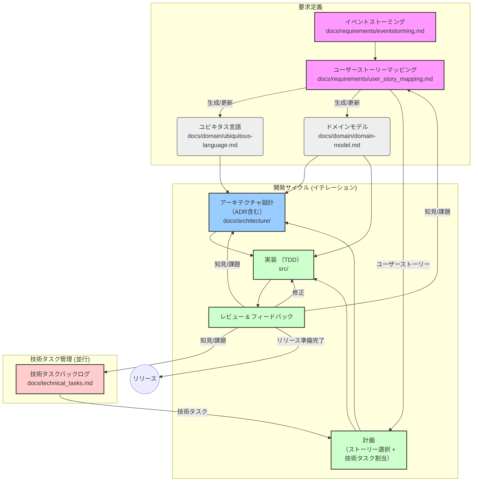

# 開発ガイドライン

このドキュメントは、本プロジェクトにおける開発プロセス、ドキュメントの役割、およびシームレスな連携を維持するためのガイドラインを定めます。

## 開発の全体像

本プロジェクトでは、ドメイン駆動設計 (DDD) の考え方に基づき、要求定義から実装までを以下の流れで進めることを推奨します。

以下、開発プロセスの各ステップの詳細です。

1.  **要求・仕様の探求 (イベントストーミングの活用)**:
    *   **目的**: ビジネス要求を深く理解し、ドメインイベント、コマンド、アクター、重要な概念を洗い出す。
    *   **手法**: ドメインエキスパートや関係者と共に**イベントストーミング**を実施します。
        *   (a) ドメインイベント（起こった事実、過去形）をオレンジ色の付箋に書き出し、時間軸に沿って並べます (例: `注文が受け付けられた`, `支払いが行われた`, `商品が発送された`)。
        *   (b) 各イベントのトリガーとなったコマンド（操作、命令形）を青色の付箋に書き、イベントの前に置きます (例: `注文を受け付ける`, `支払いを実行する`, `商品を発送する`)。
        *   (c) コマンドを実行したアクター（人、システム）を黄色の付箋に書き、コマンドの近くに置きます (例: `顧客`, `支払いシステム`, `倉庫担当者`)。
        *   (d) コマンドやイベントに関連するビジネスの中心的なモノ（集約）をピンク色の付箋に書き出します (例: `注文`, `支払い`, `在庫`)。
        *   (e) その他、参照情報（Read Model 例: `商品価格`）、外部システム（例: `配送サービス`）、ルール（Policy 例: `割引適用ルール`）、課題なども必要に応じて書き出します。
    *   **成果物**: イベントストーミングの結果（写真やオンラインボードのリンク、発見された要素リスト、主要ワークフロー、課題など）を `docs/requirements/eventstorming.md` に記録します。ここで発見された用語はユビキタス言語の重要な候補となります。

2.  **ドメインモデリングとユーザーストーリーへの落とし込み (ユーザーストーリーマッピングの活用)**:
    *   **目的**: イベントストーミングで得られた知見を基に、**ユーザー視点**で機能を整理・視覚化し、開発の優先順位を決定する。ドメインモデル設計とユビキタス言語定義のインプットとする。
    *   **手法**: **ユーザーストーリーマッピング**を実施します。
        *   **(a) バックボーンの定義 (横軸)**: ユーザーが目的を達成するための一連の**主要な活動やタスク**を洗い出します (例: `商品検索`, `カート追加`, `注文確定`, `支払い`, `注文確認`)。イベントストーミングのアクターの行動や主要コマンド群がヒントになります。これらを時間的・論理的な順序で横に並べます。
        *   **(b) ユーザーストーリーの洗い出し (縦軸)**: バックボーンの各タスクを実現するために必要な**具体的な機能**をユーザーストーリーとして記述します (例: `キーワードで商品を検索できる`, `商品をカートに入れる`, `注文内容を確認する`)。「<ユーザー種別>として、<達成したいこと>をしたい、なぜなら<理由>」形式が理想ですが、簡潔なタスク記述でも構いません。イベントストーミングのコマンドやRead Model要求がストーリーの候補になります。**エラーケースや代替フロー**も忘れずに洗い出します。
        *   **(c) マッピング**: 各ユーザーストーリーを、関連するバックボーンのタスクの下に縦に並べていきます。
        *   **(d) 優先順位付けとリリース計画**: マップ上のストーリーを、開発の優先順位（価値の高さ、緊急度、依存関係など）に基づき、**縦方向に並べ替えます**（上が優先度高）。次に、**横方向に区切り線**などを入れ、MVP（Minimum Viable Product）やリリースバージョンごとにストーリーをグルーピングします。これにより、段階的な開発計画が視覚化されます。
    *   **成果物**:
        *   ユーザーストーリーマップの結果（バックボーン、ストーリー、リリース計画）を `docs/requirements/user_story_mapping.md` に記録します。
            *   **記録形式:** チームの合意に基づき、以下のいずれか、または組み合わせを選択します。
                *   **Draw.io (diagrams.net) 図の埋め込み (`.drawio.svg`)**: 視覚的なマップが主情報源となる場合（推奨）。図を `user_story_mapping.drawio.svg` として保存し、`user_story_mapping.md` に埋め込みます。必要に応じてテキスト補足を追加します。
                *   **リスト形式**: テキストベースでの編集・管理を重視する場合。バックボーンを `###`、リリースを `##`、ストーリーを `- [ ]` で表現。
                *   **テーブル形式**: 構造的な一覧性を重視する場合。
                *   **Mermaid マインドマップ**: 階層構造の視覚化を重視する場合。
            *   **リスト形式での運用例 (`user_story_mapping.md`):**
                *   バックボーンを `###` 見出し、リリース計画を `##` 見出しで表現します。
                *   各バックボーン下に、ストーリーを `- [ ]` のタスクリスト形式で記述します。
                *   **優先順位:** 同じリリース・バックボーン内では、リストの上にあるものほど優先度が高いとします。優先度変更は行の入れ替えで行います。
                *   **完了:** ストーリーが完了したら、チェックボックスを `- [x]` に変更します。
                *   **リリース追加:** 新しいリリースは、既存リリースの下に追加していきます。
        *   この過程で明確になった用語とその定義、ルールなどを **`docs/domain/ubiquitous-language.md`** に**最重要ドキュメントとして**集約・更新します。
        *   ユーザーストーリーやイベントストーミングの結果を反映させ、ユビキタス言語に基づき、主要な集約やエンティティ、値オブジェクトの関係性を `docs/domain/domain-model.md` (Mermaid) で視覚化・詳細化します。

3.  **アーキテクチャ設計**: オニオンアーキテクチャの原則に従い、各レイヤー（Domain, Application, Infrastructure）の責務を明確にし、依存関係を定義します。重要な技術選定や設計判断は ADR (Architecture Decision Record) として記録します。
    *   **成果物**:
        *   `docs/architecture/overview.md`: アーキテクチャ概要
        *   `docs/architecture/adr/`: ADR

4.  **実装 (テスト駆動開発 - TDD)**: ユビキタス言語、ドメインモデル、ユーザーストーリーに基づき、テストファーストで実装を進めます。
    *   **Domain層**: ドメインロジックを純粋関数として実装し、単体テストで検証します。
    *   **Application層**: ユースケース（ストーリーに対応）を実装します。リポジトリ等の依存性はモック化し、テストします (`