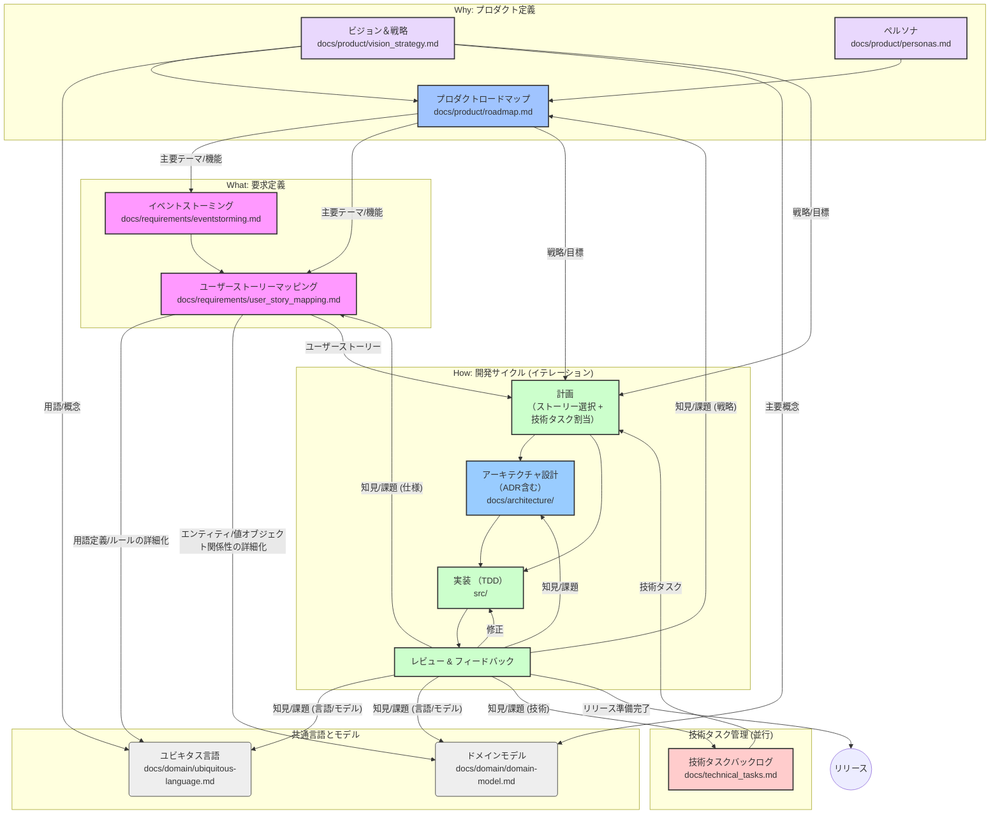

# プロダクト開発ガイドライン

このドキュメントは、本プロジェクトにおけるプロダクト開発プロセス、ドキュメントの役割、およびシームレスな連携を維持するためのガイドラインを定めます。

## プロダクト開発の全体像 (Why -> What -> How)

本プロジェクトでは、プロダクトの「Why（なぜ作るのか）」から「What（何を作るのか）」、「How（どう作るのか）」までを一貫して捉え、以下の流れで開発を進めます。
プロダクト開発の全フェーズを通じて、**ユビキタス言語**を共通言語として用い、**ドメインモデル**と共に継続的に洗練させていきます。

この図はプロダクト開発プロセス全体の流れを示しています。
**補足: 図中の「共通言語とモデル」（ユビキタス言語、ドメインモデル）は、各フェーズで定義・洗練され、開発サイクルを含む後続のすべての活動における基本的なガイド・インプットとなります（図中の出力矢印は可読性のため一部省略）。**
以下に、主要なフェーズとアクティビティについて詳述します。

## プロダクト定義 (Why)

ソフトウェアが解決すべき課題の背景にある**プロダクト全体の方向性、ターゲット顧客、および中長期的な計画**を定義するフェーズです。開発の意思決定が常にプロダクトの「Why」に紐づくように、ここで定義された内容は以降のフェーズの重要なインプットとなります。

*   **目的**: プロダクトのビジョン、戦略、ターゲット顧客、およびロードマップを定義し、チーム全体で共有する。
*   **主要なアクティビティ**: 市場調査、競合分析、顧客インタビュー（必要に応じて）。**ここでの議論はユビキタス言語を意識して行い、重要な用語や概念はその定義と共に早期に [`docs/domain/ubiquitous-language.md`](./domain/ubiquitous-language.md) に記録・共有を開始します。必要であれば、主要な概念の関係性を [`docs/domain/domain-model.md`](./domain/domain-model.md) にラフスケッチすることも有効です。**
*   **主要な成果物**:
    *   [`docs/product/vision_strategy.md`](./product/vision_strategy.md): プロダクトのビジョン、ミッション、ターゲット顧客、解決する課題、提供価値、戦略目標、KPIを定義します。半年に一度、または市場環境の変化に応じて見直します。
    *   [`docs/product/personas.md`](./product/personas.md): ターゲット顧客像を具体的に記述します。新しい顧客理解が得られた際に更新します。
    *   **(補足)** ビジョン・戦略とペルソナ（ターゲット顧客）は、どちらかが完全に先行するわけではなく、相互に影響を与えながら定義・具体化される関係にあります。
    *   [`docs/product/roadmap.md`](./product/roadmap.md): プロダクトの中長期的な開発計画を示します。通常、**テーマ**や**エピック**といった、より大きな機能単位で構成され、Now/Next/Laterなどの形式でリリースごとの大まかな時期や優先度を示します。イテレーションごとや四半期ごとに見直し・更新します。

## 要求定義 (What)

プロダクト定義フェーズで定められたロードマップや戦略に基づき、**具体的に開発する機能や仕様**を詳細化し、開発チームとステークホルダー間の共通理解を形成するフェーズです。**このフェーズは、ユビキタス言語とドメインモデルを具体的に詳細化し、洗練させる上で特に重要な役割を果たします。**

### 1. 要求・仕様の探求 (イベントストーミングの活用)
*   **目的**: ロードマップ上のテーマや機能を実現するために必要な**ビジネスプロセス、ドメインイベント、コマンド、アクター**などを洗い出す。
*   **インプット**: [`docs/product/roadmap.md`](./product/roadmap.md) (該当するテーマや機能)
*   **手法**: ドメインエキスパートや関係者と共に**イベントストーミング**を実施します。
    *   (a) ドメインイベント（起こった事実、過去形）をオレンジ色の付箋に書き出し、時間軸に沿って並べます (例: `注文が受け付けられた`, `支払いが行われた`, `商品が発送された`)。
    *   (b) 各イベントのトリガーとなったコマンド（操作、命令形）を青色の付箋に書き、イベントの前に置きます (例: `注文を受け付ける`, `支払いを実行する`, `商品を発送する`)。
    *   (c) コマンドを実行したアクター（人、システム）を黄色の付箋に書き、コマンドの近くに置きます (例: `顧客`, `支払いシステム`, `倉庫担当者`)。
    *   (d) コマンドやイベントに関連するビジネスの中心的なモノ（集約）をピンク色の付箋に書き出します (例: `注文`, `支払い`, `在庫`)。
    *   (e) その他、参照情報（Read Model 例: `商品価格`）、外部システム（例: `配送サービス`）、ルール（Policy 例: `割引適用ルール`）、課題なども必要に応じて書き出します。
*   **成果物**: イベントストーミングの結果（図、リスト、ワークフロー、課題など）を `docs/requirements/eventstorming.md` に記録します。

### 2. ドメインモデリングとユーザーストーリーへの落とし込み (ユーザーストーリーマッピングの活用)
*   **目的**: プロダクトロードマップで定義されたテーマやエピックを、開発可能な具体的な**ユーザーストーリー**に分解し、短期的なリリース計画やイテレーションでの開発順序を決定するための活動です。イベントストーミング等で得られた知見を基に、**ユーザー視点**で機能を整理・視覚化し、開発の優先順位を決定する。**このプロセスを通じて、ユビキタス言語の定義を明確にし、ドメインモデルを詳細化します。**
*   **インプット**: [`docs/product/roadmap.md`](./product/roadmap.md) (該当するテーマや機能)、`docs/requirements/eventstorming.md`
*   **手法**: **ユーザーストーリーマッピング**を実施します。
    *   **(a) バックボーンの定義 (横軸)**: ユーザーが目的を達成するための一連の**主要な活動やタスク**を洗い出します (例: `商品検索`, `カート追加`, `注文確定`, `支払い`, `注文確認`)。イベントストーミングのアクターの行動や主要コマンド群がヒントになります。これらを時間的・論理的な順序で横に並べます。
    *   **(b) ユーザーストーリーの洗い出し (縦軸)**: バックボーンの各タスクを実現するために必要な**具体的な機能**をユーザーストーリーとして記述します (例: `キーワードで商品を検索できる`, `商品をカートに入れる`, `注文内容を確認する`)。「<ユーザー種別>として、<達成したいこと>をしたい、なぜなら<理由>」形式が理想ですが、簡潔なタスク記述でも構いません。イベントストーミングのコマンドやRead Model要求がストーリーの候補になります。**エラーケースや代替フロー**も忘れずに洗い出します。
    *   **(c) マッピング**: 各ユーザーストーリーを、関連するバックボーンのタスクの下に縦に並べていきます。
    *   **(d) 優先順位付けとリリース計画**: マップ上のストーリーを、開発の優先順位（価値の高さ、緊急度、依存関係など）に基づき、**縦方向に並べ替えます**（上が優先度高）。次に、**横方向に区切り線**などを入れ、MVP（Minimum Viable Product）やリリースバージョンごとにストーリーをグルーピングします。これにより、段階的な開発計画が視覚化されます。
*   **成果物**:
    *   ユーザーストーリーマップの結果（バックボーン、ストーリー、リリース計画）を `docs/requirements/user_story_mapping.md` に記録します。
        *   **記録形式:** チームの合意に基づき、以下のいずれか、または組み合わせを選択します。
            *   **Draw.io (diagrams.net) 図の埋め込み (`.drawio.svg`)**: 視覚的なマップが主情報源となる場合（推奨）。図を `user_story_mapping.drawio.svg` として保存し、`user_story_mapping.md` に埋め込みます。必要に応じてテキスト補足を追加します。
            *   **リスト形式**: テキストベースでの編集・管理を重視する場合。バックボーンを `###`、リリースを `##`、ストーリーを `- [ ]` で表現。
            *   **テーブル形式**: 構造的な一覧性を重視する場合。
            *   **Mermaid マインドマップ**: 階層構造の視覚化を重視する場合。
        *   **リスト形式での運用例 (`user_story_mapping.md`):**
            *   バックボーンを `###` 見出し、リリース計画を `##` 見出しで表現します。
            *   各バックボーン下に、ストーリーを `- [ ]` のタスクリスト形式で記述します。
            *   **優先順位:** 同じリリース・バックボーン内では、リストの上にあるものほど優先度が高いとします。優先度変更は行の入れ替えで行います。
            *   **完了:** ストーリーが完了したら、チェックボックスを `- [x]` に変更します。
            *   **リリース追加:** 新しいリリースは、既存リリースの下に追加していきます。
    *   **(更新・詳細化)** この過程で明確になった用語とその定義、ルールなどを **[`docs/domain/ubiquitous-language.md`](./domain/ubiquitous-language.md)** に**追記・更新・詳細化**します。
    *   **(更新・詳細化)** ユーザーストーリーやイベントストーミングの結果を反映させ、ユビキタス言語 ([`docs/domain/ubiquitous-language.md`](./domain/ubiquitous-language.md)) に基づき、主要な集約やエンティティ、値オブジェクトの関係性を **[`docs/domain/domain-model.md`](./domain/domain-model.md)** (Mermaid) で**更新・詳細化**します。

## 開発サイクル (How - イテレーション)

要求定義フェーズで詳細化されたユーザーストーリーや、技術タスク管理で特定された課題に基づき、設計・実装・レビューのサイクルを反復的に回してソフトウェアを構築・改善していくフェーズです。**常に最新のユビキタス言語とドメインモデルを参照し、それらに基づいて設計・実装を行います（図には示されていませんが、これらは重要なインプットです）。**

**本プロジェクトでは、1週間の固定期間（イテレーション）で開発サイクルを回します。現在の開発体制（開発者1名とAIによるペアプログラミング）を反映しつつ、将来的なチーム開発も見据えて、各イテレーションの計画、実行、レビュー、振り返りの詳細なプロセスは [`docs/process/iteration_planning.md`](./process/iteration_planning.md) で定義されています。**

### 1. 計画 (Planning)
*   **目的**: イテレーションで取り組むゴールを設定し、ユーザーストーリーや技術タスクを選択し、優先順位を決定する。
*   **タイミング**: 各イテレーション開始時。詳細は [`docs/process/iteration_planning.md`](./process/iteration_planning.md) 参照。
*   **参加者**: **開発者（あなた）とAI。** （将来のチーム開発を見据え、プロセスは定義）
*   **インプット**:
    *   [`docs/product/vision_strategy.md`](./product/vision_strategy.md) (戦略目標)
    *   [`docs/product/roadmap.md`](./product/roadmap.md) (ロードマップ上の優先度)
    *   [`docs/requirements/user_story_mapping.md`](./requirements/user_story_mapping.md) (ユーザーストーリー)
    *   [`docs/technical_tasks.md`](./technical_tasks.md) (技術タスクバックログ)
    *   前回のイテレーションの振り返り結果 (Try項目)
*   **アクティビティ**: イテレーションゴールを設定し、**プロダクト戦略やロードマップ上の優先度、依存関係、技術的リスク等を考慮**しながら、バックログからタスクを選択・優先順位付けする。
*   **アウトプット**: イテレーションバックログ ([`docs/process/iterations/`](./process/iterations/YYYY-WW.md) など)。詳細は [`docs/process/iteration_planning.md`](./process/iteration_planning.md) 参照。

### 2. アーキテクチャ設計 (必要に応じて)
*   **目的**: 計画されたタスクを実現するために必要なアーキテクチャ上の判断や設計を行う。オニオンアーキテクチャの原則に従い、各レイヤーの責務や依存関係を維持・改善する。**ユビキタス言語とドメインモデルをガイドとして設計を進める。データベーススキーマに関する設計もここで行う。**
*   **インプット**: 計画されたタスク、[`docs/domain/ubiquitous-language.md`](./domain/ubiquitous-language.md)、[`docs/domain/domain-model.md`](./domain/domain-model.md)、既存の [`docs/architecture/`](./architecture/)、**[`docs/db/schema.sql`](./db/schema.sql)**、**[`docs/db/er-diagram.md`](./db/er-diagram.md)**
*   **アクティビティ**: 新しいパターンの導入検討、インターフェースの定義・変更（**ドメインモデルとの整合性を確認**）、ライブラリ選定、非機能要件の考慮、**データベースのテーブル設計や変更**など。重要な決定は ADR (Architecture Decision Record) として **[`docs/architecture/adr/`](./architecture/adr/)** に記録する。
*   **成果物**: 更新された設計ドキュメント（例: [`docs/architecture/overview.md`](./architecture/overview.md)）、ADR ([`docs/architecture/adr/`](./architecture/adr/))、**更新された [`docs/db/schema.sql`](./db/schema.sql) および [`docs/db/er-diagram.md`](./db/er-diagram.md) (スキーマ変更時)**。

### 3. 実装 (テスト駆動開発 - TDD)
*   **目的**: 設計や仕様に基づき、テストファーストで動作するコードを記述する。**コード内の命名（変数、関数、型など）はユビキタス言語に従う。**
*   **インプット**: 計画されたタスク、アーキテクチャ設計（もしあれば）、ユビキタス言語 ([`docs/domain/ubiquitous-language.md`](./domain/ubiquitous-language.md))、ドメインモデル ([`docs/domain/domain-model.md`](./domain/domain-model.md))。
*   **アクティビティ**:
    *   **Domain層**: ドメインロジックを純粋関数として実装し、単体テストで検証する。**ドメインモデルを直接的にコードに反映させる。**
    *   **Application層**: ユースケース（ストーリーに対応）を実装する。リポジトリ等の依存性はモック化し、テストする (`mockall` 活用)。
    *   **Infrastructure層**: リポジトリインターフェースなどを実装する。必要に応じて結合テストを行う。**データベースアクセスが伴う場合は、`sqlx` とマイグレーションツール (`sqlx-cli` など) を使用する。**
*   **該当コード**: `src/` 以下。
*   **テスト**: 各モジュール内の `#[cfg(test)] mod tests { ... }`。**テストケースの記述もユビキタス言語で行う。**
*   **完了の定義 (DoD)**: 実装が完了したとみなされる基準。詳細は [`docs/process/iteration_planning.md`](./process/iteration_planning.md) の「完了の定義」を参照。**CIでのテストパスを含む。データベーススキーマの変更が伴う場合は、対応するマイグレーションファイルが作成・適用され、`docs/db/schema.sql` が更新されていること。**

### 4. レビューとフィードバック
*   **目的**: 実装されたコードや関連ドキュメントをレビューし、品質を確保し、改善のためのフィードバックを得る。イテレーションの成果を確認し、プロセスを改善する。
*   **対象**: イテレーションで完了したコード、テスト、ドキュメント変更（ユビキタス言語 ([`docs/domain/ubiquitous-language.md`](./domain/ubiquitous-language.md))、モデル図 ([`docs/domain/domain-model.md`](./domain/domain-model.md))、ADR ([`docs/architecture/adr/`](./architecture/adr/)) など）を含む成果物全体。
*   **アクティビティ**:
    *   **ペアプログラミングによる常時レビュー:** 実装プロセス中に継続的にレビューが行われることを基本とする。
    *   **イテレーションレビュー:** イテレーション最終日に実施。**開発者（あなた）とAI**で成果物を確認し、学習とフィードバックを得る。詳細は [`docs/process/iteration_planning.md`](./process/iteration_planning.md) 参照。
    *   **振り返り (Retrospective):** イテレーション最終日に実施。**開発者（あなた）とAI**でプロセスを振り返り、改善アクションを決定する。詳細は [`docs/process/iteration_planning.md`](./process/iteration_planning.md) 参照。
*   **フィードバック**: レビューや振り返りの結果に基づき、実装の修正、アーキテクチャ設計の見直し、ユーザーストーリー（要求 ([`docs/requirements/user_story_mapping.md`](./requirements/user_story_mapping.md))）の再確認、プロダクトロードマップ ([`docs/product/roadmap.md`](./product/roadmap.md)) への影響確認、**ユビキタス言語やドメインモデルの更新提案**、新たな技術タスク ([`docs/technical_tasks.md`](./technical_tasks.md)) の特定などが行われる。

## 技術タスク管理

ユーザーストーリーに直接紐付かない技術的なタスク（例: 環境整備、アーキテクチャ改善、依存ライブラリのバージョンアップ、技術的負債の返済など）は、プロダクトの健全性や開発効率を維持するために重要であり、開発サイクルと並行して管理されます。

*   **バックログ管理**: 技術タスクは **[`docs/technical_tasks.md`](./technical_tasks.md)** にリスト形式で記録し、優先順位付けして管理します。
*   **計画への組み込み**: 優先度の高い技術タスクは、開発サイクルの「計画」フェーズでユーザーストーリーと共に選択され、イテレーションに組み込まれます。
*   **進捗管理**: ユーザーストーリーと同様に、担当者を割り当て、進捗を追跡・共有します。
*   **ドキュメント更新**: タスクの結果としてアーキテクチャなどに変更があった場合は、関連するドキュメント ([`docs/architecture/`](./architecture/) や ADR ([`docs/architecture/adr/`](./architecture/adr/))) を更新します。

## 継続的な改善

開発プロセス全体を通して得られた知見やフィードバックに基づき、要求、設計、実装、テスト、ドキュメント、そして開発プロセス自体を継続的に改善していくことが重要です。

*   **フィードバックの活用**: 特に開発サイクルの「レビューとフィードバック」フェーズからのフィードバックは重要です。これは単なるコード修正指示に留まらず、以下のような改善ループの起点となります。
    *   **実装へのフィードバック**: コードの品質改善、バグ修正など（図中: `REVIEW -- 修正 --> IMPL`)。
    *   **設計へのフィードバック**: アーキテクチャ上の問題点の指摘、より良い設計パターンの提案など。ADR ([`docs/architecture/adr/`](./architecture/adr/)) の追加・更新につながることもあります（図中: `REVIEW -- 知見/課題 --> ARCH`)。
    *   **要求へのフィードバック**: 仕様の曖昧さの発見、要求理解の齟齬の認識など。ユーザーストーリーマップ ([`docs/requirements/user_story_mapping.md`](./requirements/user_story_mapping.md)) の見直しや更新につながります（図中: `REVIEW -- 知見/課題 --> USM`)。
    *   **技術的課題へのフィードバック**: 潜在的なパフォーマンス問題の発見、ライブラリの脆弱性、テスト環境の不備など。技術タスクバックログ ([`docs/technical_tasks.md`](./technical_tasks.md)) に新しい課題として追加されます（図中: `REVIEW -- 知見/課題 --> TECH`)。
    *   **戦略へのフィードバック**: レビューを通じてプロダクト戦略やロードマップ ([`docs/product/roadmap.md`](./product/roadmap.md)) 自体への疑問や改善提案が出ることもあります。(図中: `REVIEW -- 知見/課題 (戦略) --> ROADMAP`)
*   **ドキュメントの同期**: コードの変更と関連ドキュメント（プロダクト定義 ([`docs/product/`](./product/))、要求定義 ([`docs/requirements/`](./requirements/))、ドメイン ([`docs/domain/`](./domain/))、アーキテクチャ ([`docs/architecture/`](./architecture/)) など）の同期を保つことは、継続的な改善プロセスの一部です。Pull Requestには関連ドキュメントの変更も含めることを原則とします。

## ドキュメントの役割と連携

`docs/` ディレクトリ内のドキュメントは、コードと並んでプロジェクトの重要な構成要素です。常に最新の状態を保ち、コードとの一貫性を維持することが求められます。

*   **[`docs/product/`](./product/)**: なぜこのプロダクトを作るのか、誰のために、どのような方向性で進めるのか、という**プロダクトの根幹**を定義します。開発の意思決定すべてに関わる最上位のドキュメント群です。
*   **[`docs/requirements/`](./requirements/)**: プロダクト定義に基づき、**具体的に何を作るのか**を定義します。ユーザーストーリーや仕様の源泉となります。
*   **[`docs/domain/ubiquitous-language.md`](./domain/ubiquitous-language.md)**: **プロダクト開発の全フェーズを通じて使用・洗練される共通言語**の辞書です。ビジネス、設計、コード、テスト、ドキュメント間のコミュニケーションギャップを埋めるための最も重要なツールの一つです。常に最新の状態を保ち、チーム全員が参照・貢献します。
*   **[`docs/domain/domain-model.md`](./domain/domain-model.md)**: ユビキタス言語で定義された主要な概念（エンティティ、値オブジェクトなど）とその関係性を視覚的に表現します。**ユビキタス言語と共に進化し**、複雑なドメイン構造の理解、設計の議論、コード実装のガイドとして機能します。
*   **[`docs/architecture/overview.md`](./architecture/overview.md)**: プロジェクト全体の構造、レイヤー間の依存関係ルールを示します。新しい開発者がプロジェクトの全体像を把握するために役立ちます。
*   **[`docs/architecture/adr/`](./architecture/adr/)**: なぜ特定の技術や設計パターンを採用したのか、その背景やトレードオフを記録します。将来の変更時に過去の意思決定を理解するのに役立ちます。
*   **`README.md`**: プロジェクトへの入り口です。概要、セットアップ方法、主要なドキュメントへのリンクを提供します。
*   **ソースコード (`src/`)**: 実行可能な仕様そのものです。特に `src/domain.rs` は、ドメインルールとロジックの最も正確な表現であり、**ドメインモデルとユビキタス言語が具現化されたもの**です。
    *   **ドキュメントコメント (`///`)**: `cargo doc` で生成されるドキュメント。公開APIの利用方法や目的を説明します。
    *   **テストコード (`#[test]`)**: 具体的な利用例や仕様を示します。

### シームレスな連携のためのプラクティス

*   **日本語ユビキタス言語の徹底**: **本プロジェクトでは、ドメインに関する用語は原則として日本語で定義・使用します。** プロダクト定義から実装、テストに至るまで、会話する際、コードを書く前、ドキュメントを作成する際に、常に [`docs/domain/ubiquitous-language.md`](./domain/ubiquitous-language.md) を参照・意識します。レビューでは用語の不一致を指摘します。実装における命名（変数、関数、型など）も、この日本語ユビキタス言語に従います。
*   **コードとドキュメントの同期**: コード変更（特にドメイン層やインターフェース）と同時に、関連するドキュメント（プロダクト定義、要求定義、**日本語ユビキタス言語、ドメインモデル**など）も更新します。**ペアプログラミング中に同期を意識し、イテレーション完了時には同期が取れていることを確認します。** （Pull Request は当面利用しないため、マージ前の最終確認は不要）
*   **軽量ドキュメント**: PlantUML/Mermaid や ADR など、テキストベースでバージョン管理しやすく、メンテナンスコストの低い形式を優先します。
*   **レビューの活用**: **ペアプログラミングによる常時レビュー**時に、関連ドキュメント（プロダクト定義含む）との整合性、**特に日本語ユビキタス言語とドメインモデルとの一貫性**を確認します。イテレーションレビューや振り返りもプロセス改善に活用します。

## ツールの活用

**推奨VS Code拡張機能:** このプロジェクトでの開発を快適に進めるために推奨される VS Code 拡張機能は `.vscode/extensions.json` にリストアップされています。VS Code はこのファイルを認識し、必要な拡張機能のインストールを促します。

*   **Mermaid**: `domain-model.md` や `overview.md`、**`er-diagram.md`** 内で図を描画します。Cursor (VS Code) のプレビュー機能で確認できます。
    *   **推奨拡張機能**: `bierner.markdown-mermaid` ([`.vscode/extensions.json`](../.vscode/extensions.json) に記載)
*   **Draw.io (diagrams.net)**:
    *   イベントストーミングの結果 (`docs/requirements/eventstorming.drawio.svg`) やユーザーストーリーマップ (`docs/requirements/user_story_mapping.drawio.svg`) など、より自由なレイアウトや表現が必要な図の作成・編集に使用します。
    *   `.drawio.svg` 形式で保存することで、SVGとして画像表示が可能でありながら、Draw.ioツールで再編集可能なデータを保持できます。
    *   **編集方法**: [diagrams.net](https://app.diagrams.net/) の Web サイト、または推奨拡張機能である `hediet.vscode-drawio` ([`.vscode/extensions.json`](../.vscode/extensions.json) に記載) を使用します。
*   **`sqlx-cli` (予定)**: データベースマイグレーションを管理します。
    *   マイグレーションファイルは `backend/migrations` ディレクトリ (仮) に保存されます。
    *   **マイグレーション適用後の最新スキーマは `docs/db/schema.sql` に反映させます。**
    *   ローカル開発環境やCIでマイグレーションを実行するために使用します。
*   **`cargo test`**: 実装したコードが仕様（テストケース）を満たしているかを確認します。**CI環境でも自動実行されることを目指します。** コミット前には必ずローカルでも実行します。
*   **`cargo fmt`**: コードスタイルを統一します。コミット前に実行します。
*   **`cargo clippy`**: 静的解析により、潜在的な問題や改善点を指摘します。定期的に実行します。
*   **`cargo doc`**: ソースコード中のドキュメントコメントからHTMLドキュメントを生成します。
*   **Git**: バージョン管理。コミットメッセージは **Conventional Commits** 規約 ([`docs/CONTRIBUTING.md`](./CONTRIBUTING.md) 等に規約詳細を記載することも検討) に従います。
    *   **フォーマット**: `<type>(<scope>): <subject>`
        *   `type`: コミットの種類 (例: `feat`, `fix`, `docs`, `style`, `refactor`, `test`, `chore`)。
        *   `scope` (任意): コミットが影響する範囲 (例: `domain`, `application`, `readme`, **`db`**)。
        *   `subject`: 変更内容の簡潔な説明（**日本語で記述**）。50文字以内が目安。
    *   **例**: 
        *   `feat(注文): 注文キャンセル機能を追加`
        *   `fix(domain): 価格計算時のオーバーフローを修正 (#123)`
        *   `docs: iteration_planning ガイドラインを作成`
        *   `refactor: 注文サービスの依存性注入方法を変更`
        *   `test(application): 注文受付サービスのテストケースを追加`
        *   **`feat(db): プレゼント予約テーブルの初期スキーマ定義を追加`**
    *   詳細は [Conventional Commits](https://www.conventionalcommits.org/) を参照してください。
    *   コミット前に `cargo fmt` を実行し、コードがフォーマットされていることを確認します。
