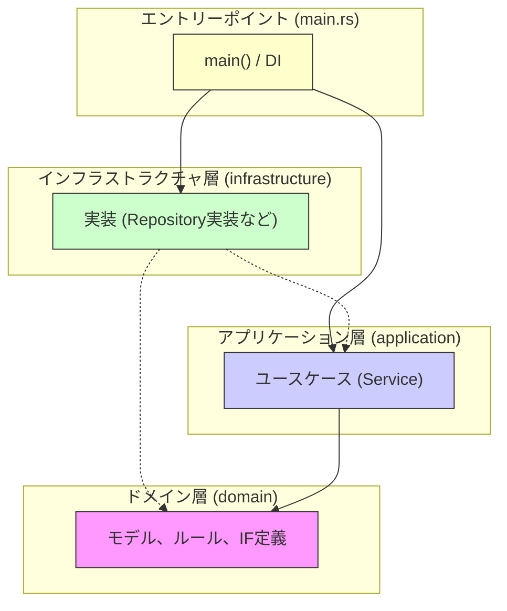

# アーキテクチャ概要

このプロジェクトは、Rustを用いた関数型プログラミングとドメイン駆動設計 (DDD) の原則に基づいています。
アーキテクチャの主要なパターンとして **オニオンアーキテクチャ** を採用しています。

## オニオンアーキテクチャ

関心の分離と依存関係の管理を目的としたレイヤードアーキテクチャの一種です。
ソフトウェアの中心にドメインモデルを配置し、その周りをアプリケーション層、インフラストラクチャ層が同心円状に取り囲みます。

### レイヤー構成

1.  **ドメイン層 (Domain Layer)**
    *   **責務**: ビジネスルール、エンティティ、値オブジェクト、ドメインイベント（もしあれば）、リポジトリインターフェース（トレイト）の定義。
    *   **特徴**: プロジェクトの中核。他のどのレイヤーにも依存しません。ビジネスの本質的な複雑さを扱います。
    *   **該当コード**: `src/domain.rs`

2.  **アプリケーション層 (Application Layer)**
    *   **責務**: ユースケースの実装。ドメインオブジェクトやサービスをオーケストレーションし、特定のアプリケーションタスク（例: 注文を受け付ける）を実行します。トランザクション管理（必要であれば）もこの層の関心事です。
    *   **特徴**: ドメイン層にのみ依存します。UIやインフラストラクチャの詳細からは独立しています。
    *   **該当コード**: `src/application.rs` (`注文サービス` など)

3.  **インフラストラクチャ層 (Infrastructure Layer)**
    *   **責務**: データベースアクセス、外部API連携、ファイルシステム操作、フレームワーク固有のコードなど、技術的な詳細を実装します。ドメイン層で定義されたリポジトリインターフェース（トレイト）を実装します。
    *   **特徴**: アプリケーション層やドメイン層に依存する可能性がありますが、主にインターフェースの実装を通じて依存関係が逆転されます。
    *   **該当コード**: `src/infrastructure.rs` (`InMemory注文Repository` など)

4.  **プレゼンテーション層 / エントリーポイント (Presentation / Entry Point)**
    *   **責務**: ユーザーインターフェース（CLI、Web APIなど）、アプリケーションの起動、依存性注入（DI）の構成。
    *   **特徴**: 全てのレイヤーに依存する可能性があります。アプリケーションを実行可能にするための「接着剤」の役割を果たします。
    *   **該当コード**: `src/main.rs`

### 依存関係の原則

**依存関係は常に外側から内側へ向かいます。**

*   `Domain` 層は他のどの層にも依存しません。
*   `Application` 層は `Domain` 層にのみ依存します。
*   `Infrastructure` 層は `Application` 層や `Domain` 層で定義されたインターフェース（トレイト）に依存（実装）します。
*   `Main` (エントリーポイント) は各層の具象クラスに依存してインスタンス化と注入を行います。

### 依存性の逆転 (Dependency Inversion Principle)

アプリケーション層やドメイン層は、具体的なインフラストラクチャの実装（例: `InMemory注文Repository`）に直接依存しません。代わりに、ドメイン層で定義された抽象的なインターフェース（例: `trait 注文Repository`）に依存します。

インフラストラクチャ層がこれらのインターフェースを実装し、アプリケーションの起動時（`main.rs`）に具体的な実装クラスのインスタンスが、インターフェースを要求するコンポーネント（例: `注文サービス`）に注入（Dependency Injection）されます。

これにより、ビジネスロジック（ドメイン層、アプリケーション層）が、データ永続化や外部通信などの技術的詳細から切り離され、疎結合でテストしやすい構造が実現されます。

## 関数型スタイルとRailway Oriented Programming (ROP)

- ドメインロジックは副作用を極力排した純粋関数として実装されています。
- `Result` 型 (`anyhow::Result` やカスタムエラー型を含む) と `map`, `and_then`, `map_err` などのコンビネータを積極的に使用し、成功経路と失敗経路を明確に分離した、直線的で読みやすいコードを目指します (Railway Oriented Programming)。エラー処理は明示的に行われます。
