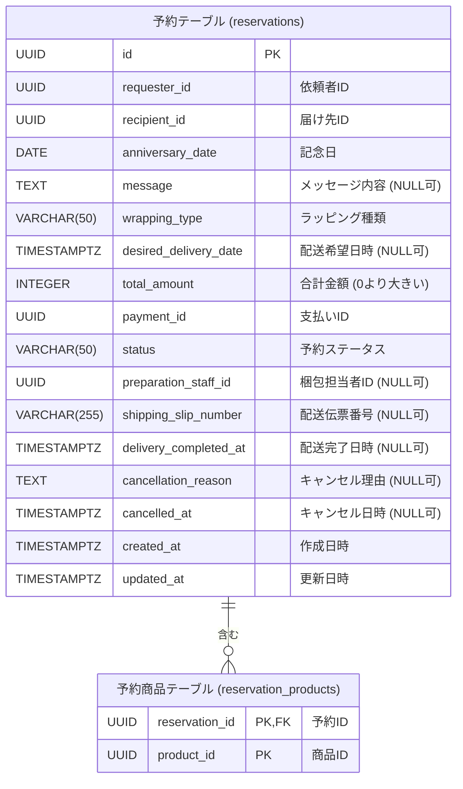

# 記念日プレゼント予約 ER図

**注記:**

*   この図は記念日プレゼント予約サービスの主要なテーブルとその関連を示します。
*   テーブル名は「日本語名 (実テーブル名)」の形式で表記しています。
*   外部キー関係は `FK` で示されます。
*   主キーは `PK` で示されます。
*   カラムの日本語名は、ドメインモデルやユビキタス言語に対応するものです。
*   NULL許容カラムには注釈で「(NULL可)」と記載しています。
*   `予約商品テーブル` は予約と商品の多対多関係を表します。
*   データ型、CHECK制約、デフォルト値、インデックスなどの詳細な定義は `schema.sql` に記載されています。 