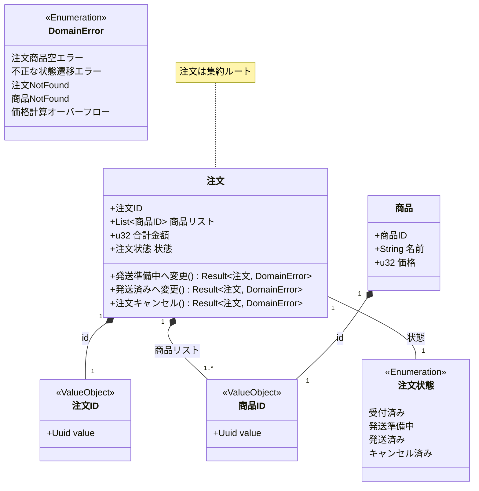

# ドメインモデル図

```mermaid
classDiagram
    class 注文 {
        +注文ID
        +List<商品ID> 商品リスト
        +u32 合計金額
        +注文状態 状態
        +発送準備中へ変更() Result<注文, DomainError>
        +発送済みへ変更() Result<注文, DomainError>
        +注文キャンセル() Result<注文, DomainError>
    }
    class 商品 {
        +商品ID
        +String 名前
        +u32 価格
    }
    class 注文ID {
      <<ValueObject>>
      +Uuid value
    }
    class 商品ID {
      <<ValueObject>>
      +Uuid value
    }
    class 注文状態 {
      <<Enumeration>>
      受付済み
      発送準備中
      発送済み
      キャンセル済み
    }
    class DomainError {
      <<Enumeration>>
      注文商品空エラー
      不正な状態遷移エラー
      注文NotFound
      商品NotFound
      価格計算オーバーフロー
    }

    注文 "1" *-- "1" 注文ID : id
    注文 "1" *-- "1..*" 商品ID : 商品リスト
    注文 "1" -- "1" 注文状態 : 状態
    商品 "1" *-- "1" 商品ID : id

    note for 注文 "注文は集約ルート"
```

上記の図は、主要なエンティティ (`注文`, `商品`)、値オブジェクト (`注文ID`, `商品ID`, `注文状態`)、およびそれらの基本的な関連性を示しています。
`注文`が集約ルート（Aggregate Root）であり、`注文状態`の遷移ロジックの一部をメソッドとして持っています。
`DomainError`はドメイン層で発生しうるエラーの種類を示します。
