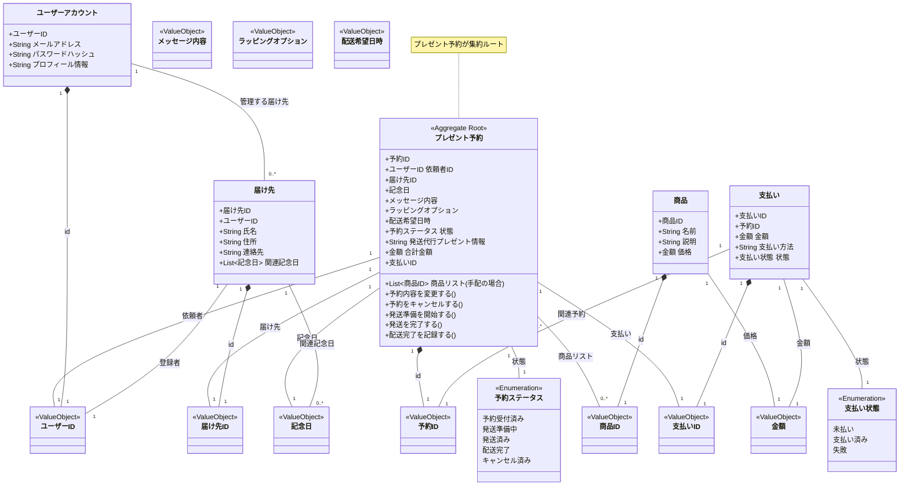
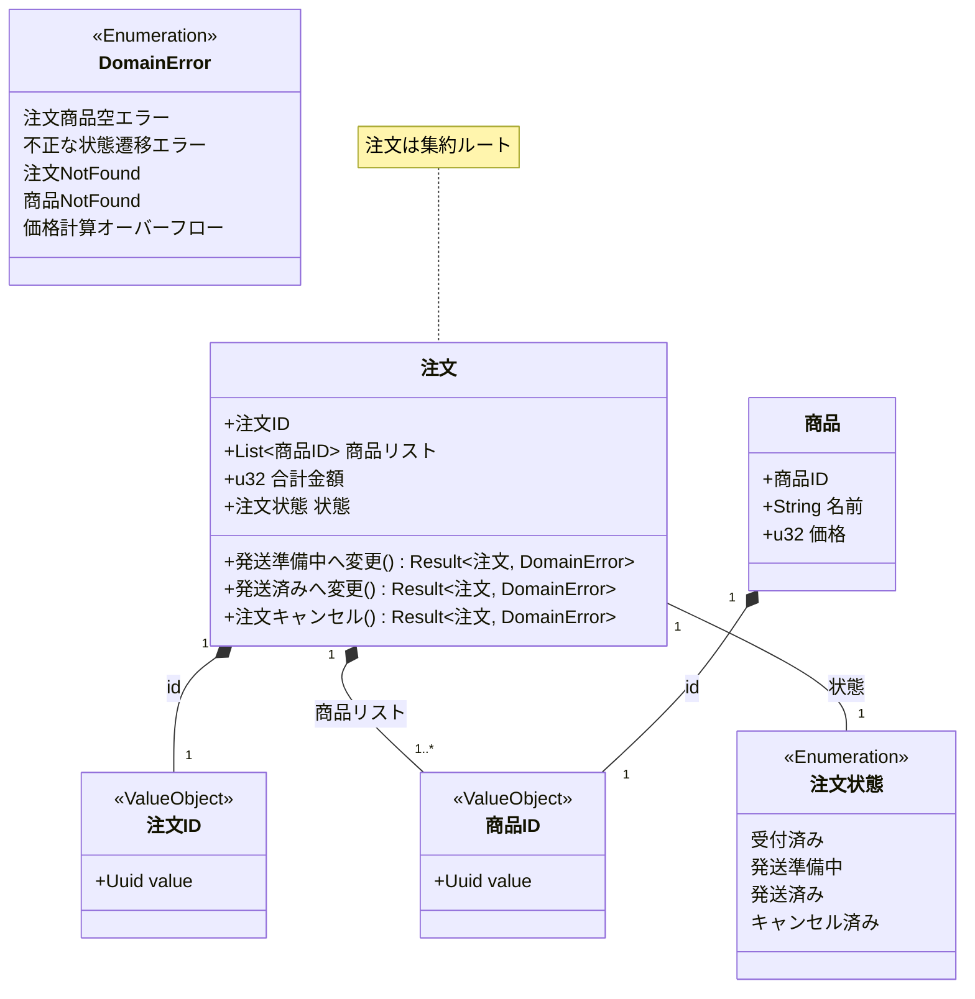

# ドメインモデル図

このドキュメントは、プロジェクトのドメインモデルを Mermaid のクラス図を用いて視覚的に表現します。
ユビキタス言語に基づき、主要なエンティティ、値オブジェクト、およびそれらの関係性を示します。

**注意:** 現在、このドキュメントには「記念日プレゼントサービス」のドメインモデル図と、初期サンプル実装に由来するドメインモデル図が混在しています。将来的にはソースコードのリファクタリングに伴い、サンプル由来のモデル図は削除される予定です。

## 記念日プレゼントサービス ドメインモデル図

上記の図は、記念日プレゼント予約・配送サービスの主要なエンティティ (`プレゼント予約`, `届け先`, `ユーザーアカウント`, `商品`, `支払い`)、関連する値オブジェクト、およびそれらの関係性を示しています。
`プレゼント予約` が中心的な集約ルート（Aggregate Root）であり、関連する情報や状態遷移ロジックを保持します。

---

## サンプル実装由来のドメインモデル図 (既存コードとの対応用)

以下のモデル図は、初期のサンプル実装 (`src/`) に基づくものです。
**注意:** これは現在の記念日プレゼントサービスのドメインモデルとは直接対応しません。

上記の図は、サンプル実装における主要なエンティティ (`注文`, `商品`)、値オブジェクト (`注文ID`, `商品ID`, `注文状態`)、およびそれらの基本的な関連性を示しています。
`注文`が集約ルート（Aggregate Root）であり、`注文状態`の遷移ロジックの一部をメソッドとして持っています。
`DomainError`はサンプル実装のドメイン層で発生しうるエラーの種類を示します。
