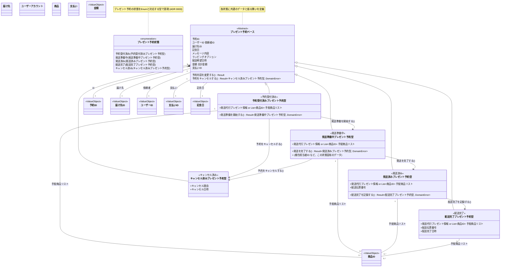
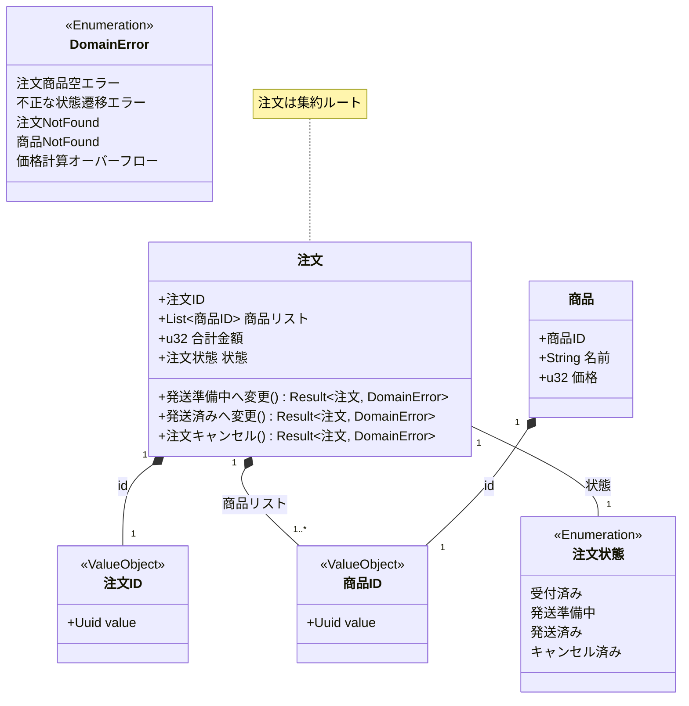

# ドメインモデル図

このドキュメントは、プロジェクトのドメインモデルを Mermaid のクラス図を用いて視覚的に表現します。
ユビキタス言語に基づき、主要なエンティティ、値オブジェクト、およびそれらの関係性を示します。

**注意:** 現在、このドキュメントには「記念日プレゼント予約・配送サービス」のドメインモデル図と、初期サンプル実装に由来するドメインモデル図が混在しています。将来的にはソースコードのリファクタリングに伴い、サンプル由来のモデル図は削除される予定です。

## 記念日プレゼント予約・配送サービス ドメインモデル図

上記の図は、記念日プレゼント予約・配送サービスのドメインモデルを、「状態を型で表現する」アプローチ (ADR 0003) に基づいて示しています。
`プレゼント予約状態` enum が予約全体のライフサイクルを表し、各状態（`予約受付済み`, `発送準備中` など）に対応する具体的な型（`予約受付済みプレゼント予約型`, `発送準備中プレゼント予約型` など）が存在します。
共通のデータや振る舞いは `プレゼント予約ベース` (抽象クラスまたはトレイトとして表現) に持たせ、状態固有のデータや遷移ロジックは各状態の型が持ちます。
状態遷移は、特定の状態の型から別の状態の型への変換関数（図中の矢印とメソッド名）として表現されます。

---

## サンプル実装由来のドメインモデル図 (既存コードとの対応用)

以下のモデル図は、初期のサンプル実装 (`src/`) に基づくものです。
**注意:** これは現在の記念日プレゼント予約・配送サービスのドメインモデルとは直接対応しません。

上記の図は、サンプル実装における主要なエンティティ (`注文`, `商品`)、値オブジェクト (`注文ID`, `商品ID`, `注文状態`)、およびそれらの基本的な関連性を示しています。
`注文`が集約ルート（Aggregate Root）であり、`注文状態`の遷移ロジックの一部をメソッドとして持っています。
`DomainError`はサンプル実装のドメイン層で発生しうるエラーの種類を示します。
