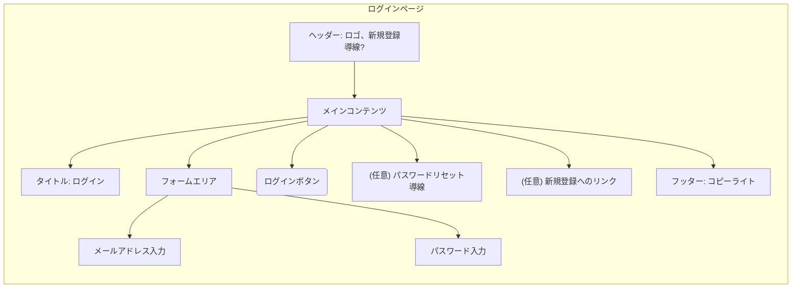

# 画面仕様: ログインページ

## 1. 関連する要求

* **User Story Mapping:**
  * [関連するバックボーン](<../requirements/user_story_mapping.md#バックボーン-アカウント登録を行う>)
    * [関連するストーリー1](<../requirements/user_story_mapping.md#登録済みのユーザーはメールアドレスとパスワードでログインできる>)
* **Event Storming:** (関連する場合)
  * コマンド: `ユーザーを認証する` (仮)
  * イベント: `ユーザーが認証された` (仮)
  * Read Model: N/A

## 2. 目的・概要

登録済みのユーザーが認証情報を入力し、サービスへのアクセス権を取得する。

## 3. レイアウト・構成

* ヘッダー
  * サービスロゴ
  * (任意) 新規登録ページへの導線
* メインコンテンツエリア
  * タイトル: "ログイン"
  * メールアドレス入力フォーム
  * パスワード入力フォーム
  * ログインボタン
  * (任意) パスワードリセットへの導線
  * (任意) 新規登録ページへのリンク (例: "アカウントをお持ちでない方はこちら")
* フッター
  * コピーライト

## 4. コンポーネント詳細と振る舞い

| コンポーネント名/役割   | 使用部品 (shadcn/ui 等) | ルール/状態/バリデーション                                                                                               | Storybook Link(s)                                   |
| :------------------------ | :------------------------ | :----------------------------------------------------------------------------------------------------------------------- | :-------------------------------------------------- |
| メールアドレス入力        | `Input` (`type="email"`)  | 必須。メールアドレス形式。                                                                                                   | (作成後にリンク)                                    |
| パスワード入力          | `Input` (`type="password"`) | 必須。入力中は非表示。                                                                                                     | (作成後にリンク)                                    |
| ログインボタン            | `Button`                  | メールアドレスとパスワードが入力されている場合に活性化。クリックで認証APIをコール。処理中はローディング表示。                  | (作成後にリンク Active, Inactive, Loading)        |
| (任意) パスワードリセット | `Link`                    | クリックするとパスワードリセットフローを開始（別画面またはモーダル）。                                                       | (作成後にリンク)                                    |
| 成功時の挙動            | -                         | ログイン成功後、ダッシュボードなど適切なページへ遷移。                                                                         | -                                                   |
| エラーメッセージ表示      | `Alert` や `Toast`        | ログイン失敗時 (認証エラー、アカウントロックなど) に表示。「メールアドレスまたはパスワードが正しくありません。」など。 | (作成後にリンク 各種エラーパターン)                 |

## 5. その他特記事項

* パスワードリセット機能は本タスクのスコープ外だが、導線は考慮しておく。

---
*最終更新日: 2025-05-18*
