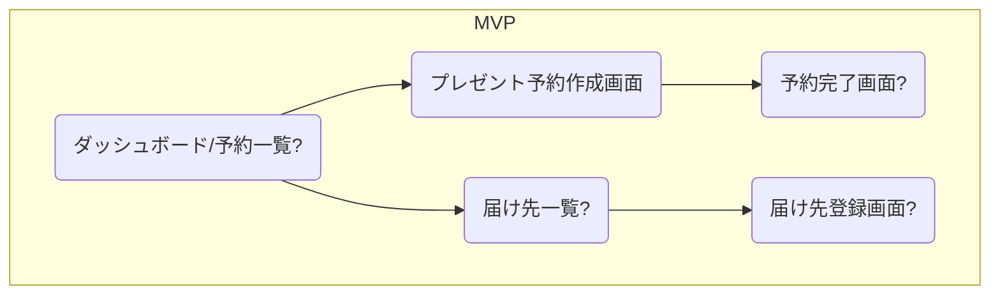

# 画面フローと構造

このドキュメントは、アプリケーション全体の主要な画面構成と画面間の遷移フローを管理します。

## 主要画面遷移図 (MVP時点)

## 主要画面一覧 (随時更新)

*   [プレゼント予約作成（発送代行）](./present-reservation-shipping-proxy.md)
*   (ログイン画面)
*   (ダッシュボード/予約一覧画面)
*   (予約完了画面)
*   (届け先一覧画面)
*   (届け先登録画面)
*   ...

---
*最終更新日: 2025-05-04* 