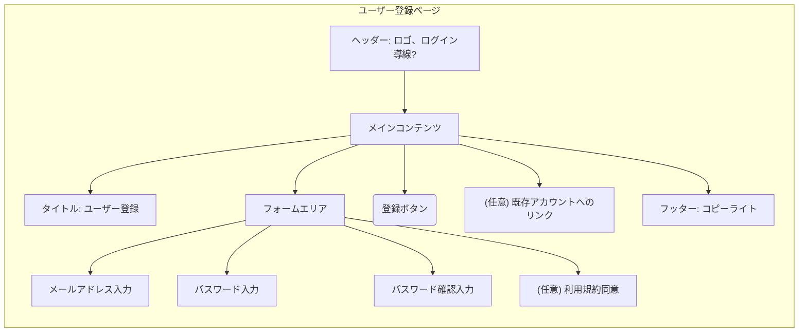

# 画面仕様: ユーザー登録ページ

## 1. 関連する要求

* **User Story Mapping:**
  * [関連するバックボーン](<../requirements/user_story_mapping.md#バックボーン-アカウント登録を行う>)
    * [関連するストーリー1](<../requirements/user_story_mapping.md#ユーザーはメールアドレスとパスワードを入力して新規登録ができる>)
* **Event Storming:** (関連する場合)
  * コマンド: `ユーザーを登録する` (仮)
  * イベント: `ユーザーが登録された` (仮)
  * Read Model: N/A

## 2. 目的・概要

ユーザーが新しいアカウントを作成するための情報を入力し、登録処理を行う。

## 3. レイアウト・構成

* ヘッダー
  * サービスロゴ
  * (任意) ログインページへの導線
* メインコンテンツエリア
  * タイトル: "ユーザー登録"
  * メールアドレス入力フォーム
  * パスワード入力フォーム
  * パスワード確認入力フォーム
  * 登録ボタン
  * (任意) 利用規約への同意チェックボックス
  * (任意) ログインページへのリンク (例: "すでにアカウントをお持ちの方はこちら")
* フッター
  * コピーライト

## 4. コンポーネント詳細と振る舞い

| コンポーネント名/役割   | 使用部品 (shadcn/ui 等) | ルール/状態/バリデーション                                                                                                | Storybook Link(s)                                   |
| :------------------------ | :------------------------ | :------------------------------------------------------------------------------------------------------------------------ | :-------------------------------------------------- |
| メールアドレス入力        | `Input` (`type="email"`)  | 必須。メールアドレス形式。サーバーサイドでの重複チェックも考慮 (エラー表示パターン)。                                       | (作成後にリンク)                                    |
| パスワード入力          | `Input` (`type="password"`) | 必須。パスワードポリシー (例: 8文字以上、英数字混合など)。入力中は非表示。                                                 | (作成後にリンク)                                    |
| パスワード確認入力      | `Input` (`type="password"`) | 必須。パスワード入力と一致すること。                                                                                        | (作成後にリンク)                                    |
| 登録ボタン              | `Button`                  | 全ての必須項目が入力され、バリデーションエラーがない場合に活性化。クリックで登録処理APIをコール。処理中はローディング表示。 | (作成後にリンク Active, Inactive, Loading)        |
| (任意) 利用規約同意     | `Checkbox`                | チェックされるまで登録ボタン非活性 (設定による)。                                                                           | (作成後にリンク)                                    |
| 成功メッセージ表示      | `Alert` や `Toast`        | 登録成功時に表示。「登録が完了しました。ログインしてください。」など。                                                      | (作成後にリンク)                                    |
| エラーメッセージ表示      | `Alert` や `Toast`        | 登録失敗時 (バリデーションエラー、サーバーエラーなど) に表示。具体的なエラー内容。                                          | (作成後にリンク 各種エラーパターン)                 |

## 5. その他特記事項

* パスワードポリシーはバックエンドのTask2.1, 2.2で定義されるものを参照。
* エラーメッセージはユーザーフレンドリーに。

---
*最終更新日: 2025-05-18*
