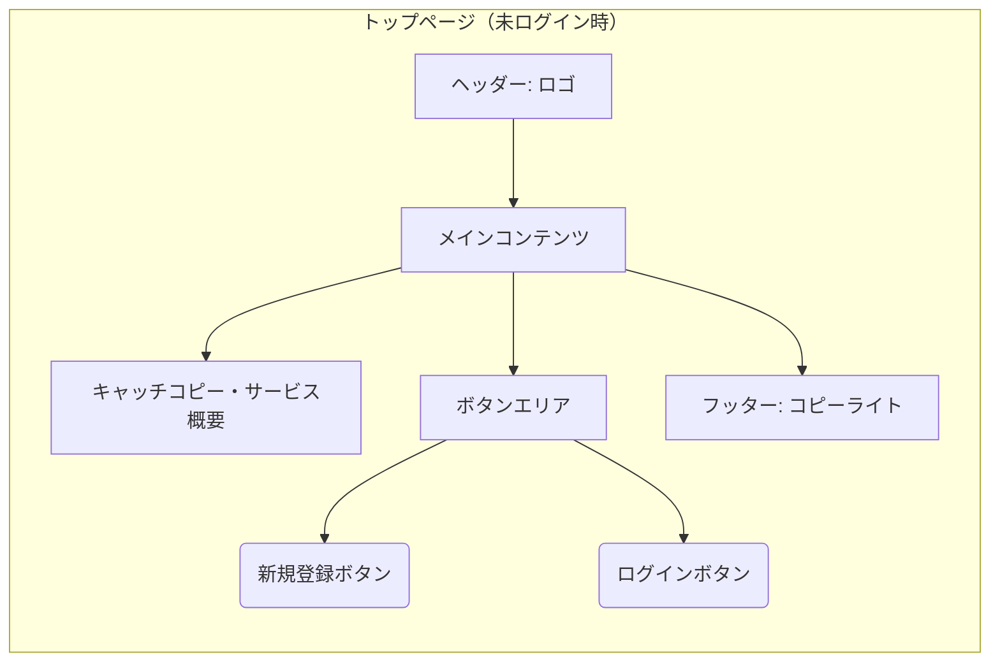

# 画面仕様: トップページ（未ログイン時）

## 1. 関連する要求

* **User Story Mapping:**
  * [関連するバックボーン](<../requirements/user_story_mapping.md#バックボーン-アカウント登録を行う>)
    * [関連するストーリー1](<../requirements/user_story_mapping.md#未ログインのユーザーはトップページから新規登録画面に遷移できる>)
    * [関連するストーリー2](<../requirements/user_story_mapping.md#未ログインのユーザーはトップページからログイン画面に遷移できる>)
* **Event Storming:** (関連する場合)
  * コマンド: N/A
  * イベント: N/A
  * Read Model: N/A

## 2. 目的・概要

未ログインのユーザーに対して、サービスへの入口として新規登録またはログインを促す。

## 3. レイアウト・構成

* ヘッダー
  * サービスロゴ
* メインコンテンツエリア
  * キャッチコピー / サービス説明 (簡単で良い)
  * 新規登録ボタン
  * ログインボタン
* フッター
  * コピーライト

## 4. コンポーネント詳細と振る舞い

| コンポーネント名/役割 | 使用部品 (shadcn/ui 等) | ルール/状態/バリデーション                                  | Storybook Link(s)                                |
| :---------------------- | :------------------------ | :---------------------------------------------------------- | :----------------------------------------------- |
| 新規登録ボタン          | `Button`                  | クリックするとユーザー登録ページへ遷移                        | (作成後にリンク)                                 |
| ログインボタン          | `Button`                  | クリックするとログインページへ遷移                          | (作成後にリンク)                                 |

## 5. その他特記事項

特になし。

---
*最終更新日: 2025-05-18*
